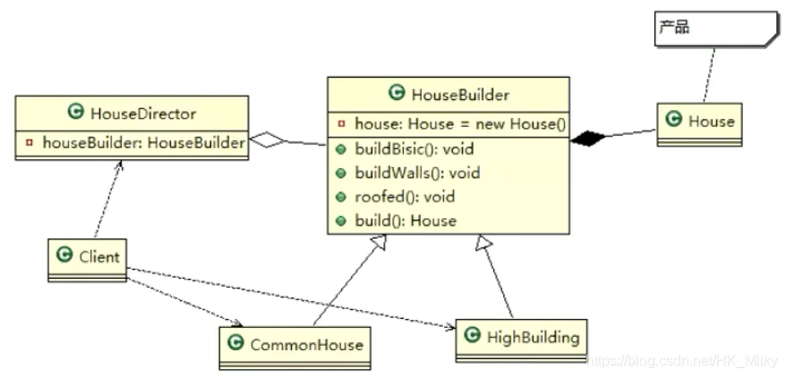
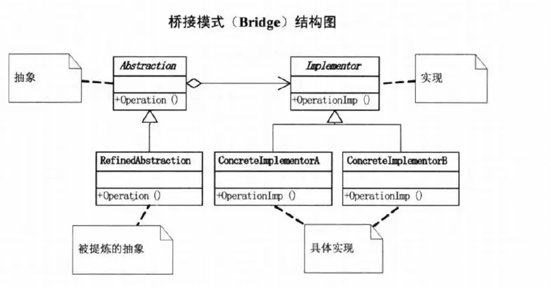

# 设计模式(Java)
## 一、什么是设计模式
软件工程中，**设计模式**是对软件设计过程中普遍存在（反复出现）的各种问题，所提出的解决方案。这些解决方案是众多软件开发人员经过相当长的一段时间的试验和错误总结出来的。设计模式代表了最佳的实践，这个术语是由埃里希·伽玛（Erich Gamma）等人在1990年代从建筑设计领域引入到计算机科学的。
## 二、设计模式的目的和原则
### 1、目的
在编写软件过程中，程序员面临着来自**耦合性，内聚性以及可维护性，可扩展性，重用性，灵活性**等多方面的挑战，设计模式是为了让程序(软件)具有更好的：

* 代码重用性（相同功能的代码，不用多次编写）
* 可读性（编程规范性，便于其它程序员的阅读和理解）
* 可扩展性（当需要新增功能时，非常的方便）
* 可靠性（当我们新增新的功能后，对原来的功能没有影响）
* 使程序呈现高内聚，低耦合的特性

### 2、原则
设计模式的原则，其实就是程序员在编程时，应当遵守的规则，也就是各种设计模式的基础，下面简单介绍一下常用的七大原则：**单一职责原则、接口隔离原则、依赖倒转（倒置）原则、里氏替换原则、开闭原则、迪米特法则、合成复用原则**。
#### 1、单一职责原则
对类来说，**一个类应该只负责一项原则**，如果类A负责两个不同职责：职责1、职责2。当职责1需求变更而改变A时，可能造成职责2执行错误，所以需要将类A的粒度分解为A1、A2。下面以以交通工具为案例讲解。

（1）案例1
```java
package com.principle.singleresponsibility;

public class SingleResponsibility1 {
    public static void main(String[] args) {
        Vehicle vehicle=new Vehicle();
        vehicle.run("汽车");
        vehicle.run("摩托车");
        vehicle.run("飞机");
    }
}
// 交通工具类
class Vehicle{
    public void run(String vehicle){
        System.out.println(vehicle+"在公路上运行。。。");
    }
}
```
在这种方式的run方法中，违背了**单一职责原则**，下面是解决方法，根据交通工具运行的方法不同，分解成不同的类。

（2）案例2
```java
package com.principle.singleresponsibility;

public class SingleResponsibility2 {
    public static void main(String[] args) {
        RoadVehicle roadVehicle=new RoadVehicle();
        roadVehicle.run("汽车");
        roadVehicle.run("摩托车");

        AirVehicle airVehicle=new AirVehicle();
        airVehicle.run("飞机");
    }
}

// 单一职责原则，但是改动很大
class RoadVehicle{
    public void run(String vehicle){
        System.out.println(vehicle+"在公路运行");
    }
}

class AirVehicle{
    public void run(String vehicle){
        System.out.println(vehicle+"在天空运行");
    }
}

class WaterVehicle{
    public void run(String vehicle){
        System.out.println(vehicle+"在水上运行");
    }
}
```
这种方式遵循了单一职责原则，但是这样做的改动很大，即**将类分解**，同时修改了客户端，可以直接修改Vehicle类，改动的代码会比较少。
（3）案例3
```java
package com.principle.singleresponsibility;

public class SingleResponsibility3 {
    public static void main(String[] args) {
        Vehicle2 vehicle2=new Vehicle2();
        vehicle2.run("汽车");
        vehicle2.runWater("轮船");
        vehicle2.runAir("飞机");
    }
}
class Vehicle2{
    public void run(String vehicle){
        System.out.println(vehicle+"在公路上运行。。。");
    }

    public void runAir(String vehicle){
        System.out.println(vehicle+"在天空运行。。。");
    }

    public void runWater(String vehicle){
        System.out.println(vehicle+"在水中运行。。。");
    }
}   
```
这种修改方法没有对原来的类做很大的修改，只是增加了方法，这里虽然**没有在类级别上遵守单一职责原则**，但是**在方法级别上，仍然是遵守单一职责的**。

（4）注意的事项和细节

* 降低类的**复杂度**，一个类只负责一项职责。
* 提高类的**可读性，可维护性**。
* 降低变更引起的风险。
* 通常情况下，我们应当遵守单一职责原则，只要逻辑足够简单，才可以在代码级违反单一职责原则；只有类中方法足够少，可以在方法级别保持单一职责原则。
#### 2、接口隔离原则
客户端不应该依赖它不需要的接口，即**一个类对另一个类的依赖应该建立在最小的接口**上。以下图为例。

图中案例，类A通过接口Interface1依赖类B，类C通过接口Interface1依赖类D，如果接口Interface1对于类A和类C来说不是最小接口，那么类B和类D必须要去实现它们不需要的方法。根据接口隔离原则，我们可以将Interface1**拆分为独立的几个接口**，类A和类C**分别与它们需要的接口建立依赖关系**。下面通过案例来对接口隔离原则进行解释。

（1）案例1

这个案例是最原始的案例，也就是上图中没有使用接口隔离原则的代码。
```java
package com.principle.segregation;

public class Segregation1 {
    
}

interface Interface1{
    void operation1();
    void operation2();
    void operation3();
    void operation4();
    void operation5();
}

class B implements Interface1{

    @Override
    public void operation1() {
        System.out.println("B实现了operation1");
    }

    @Override
    public void operation2() {
        System.out.println("B实现了operation2");
    }

    @Override
    public void operation3() {
        System.out.println("B实现了operation3");
    }

    @Override
    public void operation4() {
        System.out.println("B实现了operation4");
    }

    @Override
    public void operation5() {
        System.out.println("B实现了operation5");
    }
    
}

class D implements Interface1{

    @Override
    public void operation1() {
        System.out.println("D实现了operation1");
    }

    @Override
    public void operation2() {
        System.out.println("D实现了operation2");
    }

    @Override
    public void operation3() {
        System.out.println("D实现了operation3");
    }

    @Override
    public void operation4() {
        System.out.println("D实现了operation4");
    }

    @Override
    public void operation5() {
        System.out.println("D实现了operation5");
    }
}

class A{
    // A类通过接口Interface1 依赖B类，但是只会使用到123方法
    public void depend1(Interface1 i){
        i.operation1();
    }
    public void depend2(Interface1 i){
        i.operation2();
    }
    public void depend3(Interface1 i){
        i.operation3();
    }
}

class C{
    // C类通过接口Interface1 依赖D类，但是只会使用到145方法
    public void depend1(Interface1 i){
        i.operation1();
    }
    public void depend4(Interface1 i){
        i.operation4();
    }
    public void depend5(Interface1 i){
        i.operation5();
    }
}
```
在这个案例中，没有将Interface1拆分，从而破坏了接口隔离原则，可以将Interface1进行拆分为几个独立的接口，类A和类C分别与它们需要的接口建立依赖关系，也就是采用接口隔离原则，看下一个案例。

（2）案例2

将Interface1拆分为三个接口，如下图。


类A根据需要依赖Interface1和2，类C根据需要依赖Interface2和3，案例代码如下：
```java
package com.principle.segregation.improve;

public class Segregation1 {
    public static void main(String[] args) {
        
        A a = new A();
        a.depend1(new B());//A类通过接口去依赖
        a.depend2(new B());
        a.depend3(new B());
        C c=new C();
        c.depend1(new D());
        c.depend4(new D());
        c.depend5(new D());
    }    
}

interface Interface1{
    void operation1();
}

interface Interface2{
    void operation2();
    void operation3();
}

interface Interface3{
    void operation4();
    void operation5();
}

class B implements Interface1,Interface2{

    @Override
    public void operation1() {
        System.out.println("B实现了operation1");
    }

    @Override
    public void operation2() {
        System.out.println("B实现了operation2");
    }

    @Override
    public void operation3() {
        System.out.println("B实现了operation3");
    }
    
}

class D implements Interface1,Interface3{

    @Override
    public void operation1() {
        System.out.println("D实现了operation1");
    }

    @Override
    public void operation4() {
        System.out.println("D实现了operation4");
    }

    @Override
    public void operation5() {
        System.out.println("D实现了operation5");
    }
    
}

class A{
    // A类通过接口Interface1,Interface2 依赖B类，但是只会使用到123方法
    public void depend1(Interface1 i){
        i.operation1();
    }
    public void depend2(Interface2 i){
        i.operation2();
    }
    public void depend3(Interface2 i){
        i.operation3();
    }
}

class C{
    // C类通过接口Interface1,interface3 依赖D类，但是只会使用到145方法
    public void depend1(Interface1 i){
        i.operation1();
    }
    public void depend4(Interface3 i){
        i.operation4();
    }
    public void depend5(Interface3 i){
        i.operation5();
    }
}
```
案例中类B和类D分别实现了类A和类C需要的接口，从而实现了接口隔离原则。
#### 3、依赖倒转原则
依赖倒转原则是指：高层模块不应该依赖底层模块，二者都应该依赖其抽象；**抽象不应该依赖细节，细节应该依赖抽象**；中心思想是**面向接口编程**；设计理念：相对于细节的多变性，抽象的东西要稳定的多，以抽象为基础搭建的架构比以细节为基础的架构要稳定的多（在Java中，抽象指的是接口或抽象类，细节就是具体的实现类）。使用接口或抽象类的目的是制定好规范，而不涉及任何具体的操作，把展现细节的任务交给他们的实现类去完成。

(1)案例1

在这个案例中，实现了Person接收消息的功能。
```java
package com.principle.inversion;

public class DependencyInversion {
    public static void main(String[] args) {
        Person person=new Person();
        person.receive(new Email());
    }
}
class Email{
    public String getInfo(){
        return "电子邮件信息:hello world!";
    }
}
// 完成Person接收消息的功能
// 方式1
class Person {
    public void receive(Email email){
        System.out.println(email.getInfo());
    }
}
```
但是在这个案例中，Person通过Email发送消息，如果我们想要通过微信、短信等发送消息，我们需要新增类，同时也要在Person中新增相应的接收方法。

（2）案例2

对上一个案例的改进，引入一个抽象接口IReceiver，表示接收者，这样Person类与接口IReceiver发生依赖，因为Email,WeiXin等等属于接收范围，它们各自实现IReceiver接口就行了，这样就是依赖倒转原则。
```java
package com.principle.inversion.improve;

public class DependencyInversion {
    public static void main(String[] args) {
        Person person=new Person();
        person.receive(new Email());
        person.receive(new WeiXin());
    }
}
// 定义一个接口
interface IReceiver{
    public String getInfo();
}
class Email implements IReceiver{
    public String getInfo(){
        return "电子邮件信息:hello world!";
    }
}
// 增加微信
class WeiXin implements IReceiver{
    @Override
    public String getInfo() {
        return "微信消息:hello wechat";
    }   
}
// 完成Person接收消息的功能
// 方式2
class Person {
    public void receive(IReceiver receiver){
        System.out.println(receiver.getInfo());
    }
}
```
以上案例通过接口来实现依赖倒转原则。

（3）三种实现依赖倒转的方式

实现依赖倒转除了可以通过上面的接口传递的方式，还可以通过构造方法传递和setter方式传递。
```java
package com.principle.inversion;

public class DependencyPass {
    public static void main(String[] args) {
        ChangHong changHong1 = new ChangHong();
        OpenAndClose openAndClose = new OpenAndClose();
        openAndClose.open(changHong1);
        // 通过构造器进行依赖传递
        OpenAndClose1 openAndClose1 = new OpenAndClose1(changHong1);
        openAndClose1.open();
        // 通过 setter 方法进行依赖传递
        ChangHong2 changHong2 = new ChangHong2();
        OpenAndClose2 openAndClose2 = new OpenAndClose2();
        openAndClose2.setTv(changHong2);
        openAndClose2.open();
    }
}

// 方式 1： 通过接口传递实现依赖
// 开关的接口
interface IOpenAndClose {
    public void open(ITV tv); // 抽象方法,接收接口
}

interface ITV { // ITV 接口
    public void play();
}

class ChangHong implements ITV {
    @Override
    public void play() {
        System.out.println("长虹电视机，打开");
    }
}

// 实现接口
class OpenAndClose implements IOpenAndClose {
    public void open(ITV tv) {
        tv.play();
    }
}

// 方式 2: 通过构造方法依赖传递
interface IOpenAndClose1 {
    public void open(); // 抽象方法
}

class OpenAndClose1 implements IOpenAndClose1 {
    public ITV tv; // 成员

    public OpenAndClose1(ITV tv) { // 构造器
        this.tv = tv;
    }

    public void open() {
        this.tv.play();
    }
}

// 方式 3 , 通过 setter 方法传递
interface IOpenAndClose2 {
    public void open(); // 抽象方法
    public void setTv(ITV2 tv);
}

interface ITV2 { // ITV 接口
    public void play();
}

class OpenAndClose2 implements IOpenAndClose2 {
    private ITV2 tv;

    public void setTv(ITV2 tv) {
        this.tv = tv;
    }

    public void open() {
        this.tv.play();
    }
}

class ChangHong2 implements ITV2 {
    @Override
    public void play() {
        System.out.println("长虹电视机，打开");
    }
}
```
依赖倒转原则中需要注意：底层模块尽量都要由抽象类或接口，或者两者都有，程序稳定性更好，变量的声明类型**尽量是抽象类或接口**，这样我们的变量引用和实际对象间，就存在一个缓冲层，利于程序扩展和优化，继承遵循里氏替换原则。
#### 4、里氏替换原则
**继承存在的问题**：继承包含这样一层含义：父类中凡是已经实现好的方法，实际上是在设定规范和契约，虽然它不强制要求所有的子类必须遵循这些契约，但是如果子类对这些已经实现的方法任意修改，就会对整个继承体系造成破坏。 继承在给程序设计带来便利的同时，也带来了弊端。比如使用继承会给程序带来侵入性，程序的可移植性降低，增加对象间的耦合性，如果一个类被其他的类所继承，则当这个类需要修改时，必须考虑到所有的子类，并且父类修改后，所有涉及到子类的功能都有可能产生故障。

**里氏替换原则的介绍：** 如果对每个类型为 T1 的对象 o1，都有类型为 T2 的对象 o2，使得以 T1 定义的所有程序 P 在所有的对象 o1 都代换成 o2 时，程序 P 的行为没有发生变化，那么类型 T2 是类型 T1 的子类型。换句话说，**所有引用基类的地方必须能透明地使用其子类的对象。**在继承时，子类中尽量不要重写父类的方法，实际上，继承使两个类的耦合性增强了，在适当的情况下，可以通过聚合、组合、依赖来解决问题。

（1）案例1
```java
package com.principle.liskov;

public class Liskov {
    public static void main(String[] args) {
        A a=new A();
        System.out.println("11-3="+a.func1(11, 3));
        System.out.println("1-8="+a.func1(1, 8));
        System.out.println("--------------------------");
        B b=new B();
        System.out.println("11-3="+b.func1(11, 3));
        System.out.println("1-8="+b.func1(1, 8));
        System.out.println("11+3+9="+b.func2(11, 3));
    }
}
// A类，返回两个数字的差
class A {
    public int func1(int num1,int num2){
        return num1-num2;
    }
}
// B类，继承了A类
class B extends A{
    public int func1(int a, int b) {
        return a+b;
    }
    public int func2(int a,int b){
        return func1(a,b)+9;
    }
}
```
 
我们发现原来运行正常的相减功能发生了错误。原因就是类 B 无意中重写了父类的方法，造成原有功能出现错误。在实际编程中，我们常常会通过重写父类的方法完成新的功能，这样写起来虽然简单，但整个继承体系的复用性会比较差。特别是运行多态比较频繁的时候。 通用的做法是：**原来的父类和子类都继承一个更通俗的基类**，原有的继承关系去掉，采用依赖，聚合，组合等关系代替。

（2）案例二
```java
package com.principle.liskov.improve;

public class Liskov {
    public static void main(String[] args) {
        A a=new A();
        System.out.println("11-3="+a.func1(11, 3));
        System.out.println("1-8="+a.func1(1, 8));
        System.out.println("--------------------------");
        B b=new B();
        System.out.println("11+3="+b.func1(11, 3));
        System.out.println("1+8="+b.func1(1, 8));
        System.out.println("11+3+9="+b.func2(11, 3));
        System.out.println("11-3="+b.func3(11, 3));
    }
}
//创建一个更加基础的基类
class Base {
    // 把更加基础的方法和成员写到积累里面
}
// A类，返回两个数字的差
class A extends Base {
    public int func1(int num1,int num2){
        return num1-num2;
    }
}
// B类，继承了Base类
class B extends Base{
    // 如果B需要使用A类的方法，使用组合关系
    private A a=new A();
    public int func1(int a, int b) {
        return a+b;
    }
    public int func2(int a,int b){
        return func1(a,b)+9;
    }
    //我们仍然要使用A的方法
    public int func3(int a,int b){
        return this.a.func1(a, b);
    }
}
```
在这个案例中，我们创建了一个更加基础的基类，把更加基础的方法和成员写到Base类中，使A和B类同时继承基类Base，如果B要使用A类中的方法，使用组合关系。
#### 5、开闭原则
开闭原则（Open Closed Principle）是编程中**最基础、最重要**的设计原则。一个软件实体如类，模块和函数应该对扩展开放（对提供方），对修改关闭（对使用方）。用抽象构建框架，用实现扩展细节。当软件需要变化时，尽量通过**扩展软件实体的行为**来实现变化，而不是通过修改已有代码来实现变化。

（1）案例1
```java
package com.principle.ocp;

public class Ocp {
    public static void main(String[] args) {
        GraphicEditor graphicEditor=new GraphicEditor();
        graphicEditor.drawRectangle(new Rectangle());
        graphicEditor.drawCircle(new Circle()); 
    }
}

// 这是一个用于绘图的类
class GraphicEditor{
    public void drawShape(Shape s){
        if(s.m_type==1){
            drawRectangle(s);
        }else if(s.m_type==2){
            drawCircle(s);
        }
    }
    public void drawRectangle(Shape r){
        System.out.println("绘制矩形");
    }
    public void drawCircle(Shape r){
        System.out.println("绘制圆形");
    }
}
class Shape{
    int m_type;
}
class Rectangle extends Shape{
    Rectangle(){
        super.m_type=1;
    }
}
class Circle extends Shape{
    Circle(){
        super.m_type=2;
    }
}
```
在这个案例中，并没有遵守**开闭原则**，即当我们给类增加新功能的时候，尽量不修改代码，或者尽可能少修改代码，但是在这个案例中，我们需要新增一个图形种类的时候，我们需要修改较多的地方。

（2）案例2

把创建 Shape 类做成抽象类，并提供一个抽象的 draw 方法，让子类去实现即可，这样我们有新的图形种类时，只需要让新的图形类继承 Shape，并实现 draw 方法即可，使用方的代码就不需要修改，满足了开闭原则。
```java
package com.principle.ocp.improve;

public class Ocp {
    public static void main(String[] args) {
        GraphicEditor graphicEditor=new GraphicEditor();
        graphicEditor.drawShape(new Rectangle());
        graphicEditor.drawShape(new Circle()); 
    }
}

// 这是一个用于绘图的类
class GraphicEditor{
    public void drawShape(Shape s){
       s.draw();
    }
}
abstract class Shape{
    int m_type;
    public abstract void draw();//抽象方法
}
class Rectangle extends Shape{
    Rectangle(){
        super.m_type=1;
    }

    @Override
    public void draw() {
        System.out.println("绘制矩形");
    }

    
}
class Circle extends Shape{
    Circle(){
        super.m_type=2;
    }
    @Override
    public void draw() {
        System.out.println("绘制圆形");
    }
}
```
这个案例满足了开闭原则，在新增功能的时候，修改少量的代码就可以完成。
#### 6、迪米特法则
迪米特法则又叫**最少知道原则**，即一个类对自己依赖的类知道的越少越好。也就是说，对于被依赖的类不管多么复杂，都尽量将逻辑封装在类的内部，对外除了提供的public方法，不对外泄露任何信息。或者更简单的定义：只与直接朋友通信。 **直接的朋友**：每个对象都会与其他对象有耦合关系，只要两个对象之间有耦合关系，我们就说这两个对象之间是朋友关系。耦合的方式很多，依赖，关联，组合，聚合等。其中，我们称出现的**成员变量，方法参数，方法返回值**中的类为直接的朋友，而出现在局部变量中的类不是直接的朋友。也就是说，陌生的类最好不要以局部变量的形式出现在类的内部。

（1）案例1

这个案例中：有一个学校，下属有各个学院和总部，打印出学校总部员工 ID 和学院员工的 id。
```java
package com.principle.demeter;

import java.util.ArrayList;
import java.util.List;

public class Demeter1 {
    public static void main(String[] args) {
        // 创建一个SchoolManager对象
        SchoolManager schoolManager=new SchoolManager();
        schoolManager.printAllEmployee(new CollegeManager());
    }   
}
class Employee {
	private String id;

	public void setId(String id) {
		this.id = id;
	}
	public String getId() {
		return id;
	}
}
class CollegeEmployee {
	private String id;
	public void setId(String id) {
		this.id = id;
	}
	public String getId() {
		return id;
	}
}

class CollegeManager {
	public List<CollegeEmployee> getAllEmployee() {
		List<CollegeEmployee> list = new ArrayList<CollegeEmployee>();
		for (int i = 0; i < 10; i++) {
			CollegeEmployee emp = new CollegeEmployee();
			emp.setId("学院员工id= " + i);
			list.add(emp);
		}
		return list;
	}
}
// SchoolManager类的直接朋友有Employee和CollegeManager
// CollegeEmployee不是直接朋友，这样做违反了迪米特法则
class SchoolManager {
	public List<Employee> getAllEmployee() {
		List<Employee> list = new ArrayList<Employee>();	
		for (int i = 0; i < 5; i++) {
			Employee emp = new Employee();
			emp.setId("学校总部员工id= " + i);
			list.add(emp);
		}
		return list;
	}
	void printAllEmployee(CollegeManager sub) {	
		List<CollegeEmployee> list1 = sub.getAllEmployee();
		System.out.println("------------分公司员工------------");
        // CollegeEmployee不是SchoolManager的直接朋友
        // 因为它是以局部变量的形式存在
		for (CollegeEmployee e : list1) {
			System.out.println(e.getId());
		}
		List<Employee> list2 = this.getAllEmployee();
		System.out.println("------------学校总部员工------------");
		for (Employee e : list2) {
			System.out.println(e.getId());
		}
	}
}
```
在这个案例中SchoolManager类的直接朋友有Employee和CollegeManager，CollegeEmployee不是直接朋友（因为它是以局部变量的形式存在的），这样做违反了迪米特法则。

（2)案例2

前面设计的问题在于 SchoolManager 中，CollegeEmployee 类并不是 SchoolManager 类的直接朋友。 按照迪米特法则，应该避免类中出现这样非直接朋友关系的耦合。
```java
package com.principle.demeter.improve;

import java.util.ArrayList;
import java.util.List;

public class Demeter1 {
    public static void main(String[] args) {
        // 创建一个SchoolManager对象
        SchoolManager schoolManager=new SchoolManager();
        schoolManager.printAllEmployee(new CollegeManager());
    }
}

class Employee {
	private String id;

	public void setId(String id) {
		this.id = id;
	}

	public String getId() {
		return id;
	}
}


class CollegeEmployee {
	private String id;

	public void setId(String id) {
		this.id = id;
	}

	public String getId() {
		return id;
	}
}


class CollegeManager {
	public List<CollegeEmployee> getAllEmployee() {
		List<CollegeEmployee> list = new ArrayList<CollegeEmployee>();
		for (int i = 0; i < 10; i++) {
			CollegeEmployee emp = new CollegeEmployee();
			emp.setId("学院员工id= " + i);
			list.add(emp);
		}
		return list;
	}

	// 输出学院员工的信息
	public void printEmployee(){
		List<CollegeEmployee> list1 = this.getAllEmployee();
		System.out.println("------------学院员工------------");
		for (CollegeEmployee e : list1) {
			System.out.println(e.getId());
		}
	}

}

class SchoolManager {
	public List<Employee> getAllEmployee() {
		List<Employee> list = new ArrayList<Employee>();
		
		for (int i = 0; i < 5; i++) {
			Employee emp = new Employee();
			emp.setId("学校总部员工id= " + i);
			list.add(emp);
		}
		return list;
	}

	void printAllEmployee(CollegeManager sub) {
		sub.printEmployee();		
		List<Employee> list2 = this.getAllEmployee();
		System.out.println("------------学校总部员工------------");
		for (Employee e : list2) {
			System.out.println(e.getId());
		}
	}
}
```
**迪米特法则的核心是降低类之间的耦合**, 
但是注意：由于每个类都减少了不必要的依赖，因此迪米特法则只是要求降低类间(对象间)耦合关系，并不是要求完全没有依赖关系。

#### 7、合成复用原则
合成复用原则是**尽量使用合成/聚合的方式，而不是继承**。核心思想是：找出应用中可能需要变化之处，把它们独立出来，不要和那些不需要变化的代码混在一起。针对接口编程，而不是针对实现编程，为了交互对象之间的松耦合设计而努力。

## 三、设计模式概述
设计模式是程序员在面对同类软件工程设计问题所总结出来的有用的经验，模式不是代码，而是某类问题的通用解决方案，设计模式（Design pattern）代表了最佳的实践。这些解决方案是众多软件开发人员经过相当长的一段时间的试验和错误总结出来的。设计模式的本质**提高软件的维护性、通用性和扩展性，并降低软件的复杂度**。设计模式并不局限于某种语言，java，php，c++ 都有设计模式。设计模式分为三种类型，共23种。

* 创建型模式：单例模式、抽象工厂模式、原型模式、建造者模式、工厂模式。
* 结构型模式：适配器模式、桥接模式、装饰模式、组合模式、外观模式、享元模式、代理模式。
* 行为型模式： 模版方法模式、命令模式、访问者模式、迭代器模式、观察者模式、中介者模式、备忘录模式、解释器模式（Interpreter 模式）、状态模式、策略模式、职责链模式(责任链模式)

> 不同的书籍上对分类和名称略有差异

## 四、单例设计模式
### 1、简介
所谓类的单例设计模式，就是**采取一定的方法保证在整个的软件系统中，对某个类只能存在一个对象实例**，并且该类只提供一个取得其对象实例的方法(静态方法)。
>比如 Hibernate 的 SessionFactory，它充当数据存储源的代理，并负责创建 Session 对象。SessionFactory 并不是轻量级的，一般情况下，一个项目通常只需要一个 SessionFactory 就够，这是就会使用到单例模式。

### 2、单例设计模式的八种方式
#### （1）饿汉式（静态常量）
创建一个饿汉式（静态常量）应用实例的步骤可以分为一下几步：

* 构造器私有化（防止外部new）
* 类的内部创建对象
* 向外暴露一个静态的公共方法。getInstance

实例代码如下：
```java
package com.singleton.type1;

public class Singleton1 {
    public static void main(String[] args) {
        Singleton instance1=Singleton.getInstance();
        Singleton instance2=Singleton.getInstance();
        System.out.println(instance1==instance2);      
        System.out.println("instance2.hashCode1="+instance1.hashCode());
        System.out.println("instance2.hashCode1="+instance2.hashCode());
    }
}
// 饿汉式（使用静态变量来写）
class Singleton{
    // 1、先将构造器私有化，外部不能new
    private Singleton(){

    }
    // 2、本类内部创建对象实例
    private final static Singleton instance = new Singleton();
    // 3、对外提供一个公有的方法返回实例对象
    public static Singleton getInstance(){
        return instance;
    }
}
```
最后程序代码输出的结果是：两个对象相等，并且返回的hash值也是一样的。
>优缺点说明：

> * 优点：这种写法比较简单，就是在类装载的时候就完成实例化。避免了线程同步问题。
> * 在类装载的时候就完成实例化，没有达到 Lazy Loading的效果。如果从始至终从未使用过这个实例，则会造成内存的浪费。
> * 结论：这种单例模式可用，可能造成内存浪费
 
这种方式基于 classloder 机制避免了多线程的同步问题，不过，instance 在类装载时就实例化，在单例模式中大多数都是调用 getInstance 方法，但是导致类装载的原因有很多种，因此不能确定有其他的方式（或者其他的静态方法）导致类装载，这时候初始化 instance 就没有达到 lazy loading 的效果。
#### （2）饿汉式（静态代码块）
这种方法是根据上一种方法进行改进的，将上一种的静态变量改为静态代码块。
```java

// 饿汉式（使用静态变量来写）
class Singleton{
    // 1、先将构造器私有化，外部不能new
    private Singleton(){

    }
    // 2、本类内部创建对象实例
    private final static Singleton instance;

    static { //在静态代码块中创建单例对象
        instance = new Singleton();
    }
    // 3、对外提供一个公有的方法返回实例对象
    public static Singleton getInstance(){
        return instance;
    }
}
```
最终的输出结果和上一个相同
> 优缺点说明

> * 这种方式和上面的方式其实类似，只不过将类实例化的过程放在了静态代码块中，也是在类装载的时候，就执行静态代码块中的代码，初始化类的实例。优缺点和上面是一样的。
> * 结论：这种单例模式可用，但是可能造成内存浪费


#### （3）懒汉式（线程不安全）
上述两种方法都是线程安全的方法，但是都会造成线程的浪费。下面是一种线程不安全的方法。
```java
package com.singleton.type3;

public class Singleton3 {
    public static void main(String[] args) {
        Singleton instance1=Singleton.getInstance();
        Singleton instance2=Singleton.getInstance();
        System.out.println(instance1==instance2);      
        System.out.println("instance2.hashCode1="+instance1.hashCode());
        System.out.println("instance2.hashCode1="+instance2.hashCode());
    }
}

class Singleton{
    private static Singleton instance;
    private Singleton(){}
    // 提供一个静态的公有方法，当使用该方法时，才去创建instance
    // 懒汉式
    // 用到时候才创建
    public static Singleton getInstance(){
        if(instance==null){
            instance=new Singleton();
        }
        return instance;
    }
}
```
> 优缺点说明

> * 起到了Lazy Loading的效果，但是只能在单线程下使用。 
> * 如果在多线程下，一个线程进入了 if (singleton == null)判断语句块，还未来得及往下执行，另一个线程也通过了这个判断语句，这时便会产生多个实例。所以在多线程环境下不可使用这种方式。
> * 结论：在实际开发中，不要使用这种方式。

#### （4）懒汉式（线程安全，同步方法）
针对上一种方法的缺陷，使用**synchronized**关键字可以实现线程安全。
```java
package com.singleton.type4;

public class Singleton4 {
    public static void main(String[] args) {
        Singleton instance1=Singleton.getInstance();
        Singleton instance2=Singleton.getInstance();
        System.out.println(instance1==instance2);      
        System.out.println("instance2.hashCode1="+instance1.hashCode());
        System.out.println("instance2.hashCode1="+instance2.hashCode());
    }
}
//懒汉式第二种（线程安全，同步方法）
class Singleton{
    private static Singleton instance;
    private Singleton(){}
    // 提供一个静态的公有方法，加入了一个同步处理的代码，当使用该方法时，才去创建instance
    // 懒汉式
    // 用到时候才创建
    public static synchronized Singleton getInstance(){
        if(instance==null){
            instance=new Singleton();
        }
        return instance;
    }
}
```
> 优缺点说明：

> * 解决了线程安全问题
> * 效率太低了，每个线程在想获得类的实例时候，执行getInstance()方法都要进行同步。而其实这个方法只执行一次实例化代码就够了，后面的想获得该类实例，直接 return 就行了。方法进行同步效率太低。
> * 结论：在实际开发中，不推荐使用这种方式
#### （5）懒汉式（线程安全，同步代码块）
这种方式只是对上一种方式的改进，同样不推荐使用。只是将synchronized关键字换了一个位置而已。
```java
 public static Singleton getInstance(){
        if(instance==null){
            synchronized (Singleton.class){
                instance=new Singleton();
            }
        }
        return instance;
    }
```
#### （6）双重检查
根据以上方式存在的优缺点，提出了双重检查的方式，提供一个静态的公有方法，加入双重检查代码，解决线程安全问题, 同时解决懒加载问题
同时保证了效率, 推荐使用。
```java

//懒汉式第二种（线程安全，同步方法）
class Singleton{
    private static volatile Singleton instance;
    private Singleton(){}
    // 提供一个静态的公有方法，加入双重检查的代码，解决线程安全，同时解决懒加载的问题
    // 同时保证了效率
    public static Singleton getInstance(){
        if(instance==null){
            synchronized(Singleton.class){
                if(instance==null){
                    instance=new Singleton();
                }
            }
        }
        return instance;
    }
}
```
> 优缺点说明

> *  Double-Check 概念是多线程开发中常使用到的，如代码中所示，我们进行了两次 if (singleton == null)检查，这样就可以保证线程安全了。
> * 这样，实例化代码只用执行一次，后面再次访问时，判断 if (singleton == null)，直接 return 实例化对象，也避免的反复进行方法同步。
> * 线程安全，延迟加载，效率较高
> * 在实际开发中，推荐使用这种单例设计模式。
#### （7）静态内部类
上述方法都是作用于方法上的，可以直接创建一个内部类来使用。
```java
//静态内部类完成，推荐使用
class Singleton{
    private Singleton(){}

    // 写一个静态内部类，该类有一个静态属性Singleton
    private static class SingletonInstance{
        private static final Singleton INSTANCE =new Singleton();
    }

    // 提供一个静态的公有方法，加入双重检查的代码，解决线程安全，同时解决懒加载的问题
    // 同时保证了效率
    public static Singleton getInstance(){
        return SingletonInstance.INSTANCE;
    }
}
```
> 优缺点说明

> * 这种方式采用了类装载的机制来保证初始化实例时只有一个线程。
> * 静态内部类方式在 Singleton 类被装载时并不会立即实例化，而是在需要实例化时，调用 getInstance 方法，才会装载 SingletonInstance 类，从而完成 Singleton 的实例化。
> * 类的静态属性只会在第一次加载类的时候初始化，所以在这里，JVM 帮助我们保证了线程的安全性，在类进行初始化时，别的线程是无法进入的。
> * 优点：避免了线程不安全，利用静态内部类特点实现延迟加载，效率高。
> * 开发中推荐使用
#### （8）枚举
通过枚举也可以实现单例
```java
package com.singleton.type8;

public class Singleton8 {
    public static void main(String[] args) {
        Singleton instance1=Singleton.INSTANCE;
        Singleton instance2=Singleton.INSTANCE;
        System.out.println(instance1==instance2);
        System.out.println("instance2.hashCode1="+instance1.hashCode());
        System.out.println("instance2.hashCode1="+instance2.hashCode());
        instance1.sayOK();
    }    
}

// 使用枚举
enum Singleton {
    INSTANCE; //属性
    public void sayOK(){
        System.out.println("ok~");
    }
}
```
> 优缺点说明：

> * 这借助 JDK1.5 中添加的枚举来实现单例模式。不仅能避免多线程同步问题，而且还能防止反序列化重新创建新的对象。
> * 这种方式是 Effective Java 作者 Josh Bloch 提倡的方式
> 结论：推荐使用。

### 3、单例模式注意事项和细节说明
 单例模式保证了 系统内存中该类只存在一个对象，节省了系统资源，对于一些需要频繁创建销毁的对象，使用单例模式可以提高系统性能。当想实例化一个单例类的时候，必须要记住使用相应的获取对象的方法，而不是使用 new。 
单例模式使用的场景：需要**频繁的进行创建和销毁的对象、创建对象时耗时过多或耗费资源过多**(即：重量级对象)，但又经常用到的对象、工具类对象、频繁访问数据库或文件的对象(比如数据源、session工厂等)。


## 五、工厂模式

### 1、问题引入
看一个披萨的项目：要便于披萨种类的扩展，要便于维护：（1）披萨的种类很多(比如 GreekPizz、CheesePizz等) （2）披萨的制作有 prepare，bake, cut, box （3）完成披萨店订购功能。

考虑解决这个问题，首先使用传统的方法：创建一个抽象的Pizza类，里面包含了披萨制作的通用方法（包括prepare、bake等），然后各种不同种类的Pizza需要继承该抽象类然后实现其中的抽象方法。最终通过OrderPizza对不同的Pizza进行订购。

```java
public OrderPizza(){
    Pizza pizza=null;
    String orderType;//订购披萨的类型
    do{
        orderType=gettype();
        if(orderType.equals("greek")){
            pizza=new GreekPizza();
            pizza.setName(" 希腊披萨 ");
        }else if(orderType.equals("cheese")){
            pizza=new CheesePizza();
            pizza.setName(" 奶酪披萨 ");
        }else if(orderType.equals("pepper")){
            pizza=new PepperPizza();
            pizza.setName(" 胡椒披萨 ");
        }else {
            break;
        }
        // 输出pizza制作的过程
        pizza.prepare();
        pizza.bake();
        pizza.cut();
        pizza.box();
    }while(true);
}
```

**传统方法的优缺点：**（1）优点是比较好理解，简单易操作。（2） 缺点是**违反了设计模式的 ocp 原则**，即对扩展开放，对修改关闭。即当我们给类增加新功能的时候，尽量不修改代码，或者尽可能少修改代码。所以当我们需要新增一个Pizza类的时候，**需要在OrderPizza中重新写一条if语句进行判断。** 下面通过工厂模式对上述方法进行改进。
### 2、简单工厂模式
#### 基本介绍
 （1）简单工厂模式是属于创建型模式，是工厂模式的一种。**简单工厂模式是由一个工厂对象决定创建出哪一种产品类的实例**。简单工厂模式是工厂模式家族中最简单实用的模式。
 
（2）简单工厂模式：定义了一个创建对象的类，**由这个类来封装实例化对象的行为(代码)**

（3） 在软件开发中，当我们会用到大量的创建某种、某类或者某批对象时，就会使用到工厂模式。
#### 优化上面的实例
简单工厂模式的设计方案：定义一个可以实例化**Pizza**对象的类，封装创建对象的代码。所以创建一个**SimplePizzaFactory**，在这个类中进行**Pizza**的创建。
```java
public class SimpleFactory {

    public Pizza createPizza(String orderType){
        Pizza pizza=null;
        System.out.println("使用简单工厂模式");
        if(orderType.equals("greek")){
            pizza=new GreekPizza();
            pizza.setName(" 希腊披萨 ");
        }else if(orderType.equals("cheese")){
            pizza=new CheesePizza();
            pizza.setName(" 奶酪披萨 ");
        }else if(orderType.equals("pepper")){
            pizza=new PepperPizza();
            pizza.setName(" 胡椒披萨 ");
        }
        return pizza;
    }
}
```
这个**简单工厂类**用来创建Pizza，在**OrderPizza**进行调用这个类中的方法来创建相应的Pizza。

### 3、工厂方法模式

#### 简单工厂模式的不足
披萨项目新的需求：客户在点披萨时，可以点不同口味的披萨，比如 北京的奶酪 pizza、北京的胡椒pizza或者是伦敦的奶酪 pizza、伦敦的胡椒pizza。

解决方法：使用简单工厂模式，创建不同的简单工厂类，比如**BJPizzaSimpleFactory、LDPizzaSimpleFactory**等等.从当前
这个案例来说，也是可以的，但是考虑到项目的规模，以及软件的可维护性、可扩展性并不是特别好。下面介绍工厂方法模式。
#### 简单介绍
工厂方法模式设计方案：将披萨项目的实例化功能抽象成抽象方法，在不同的口味点餐子类中具体实现。工厂方法模式：定义了一个创建对象的抽象方法，由子类决定要实例化的类。**工厂方
法模式将对象的实例化推迟到子类。**
```java
public abstract class OrderPizza {
    // 定义一个抽象方法，让各个工厂子类自己实现
    abstract Pizza createPizza(String orderType);
    public OrderPizza(){
        Pizza pizza=null;
        String orderType;//订购披萨的类型
        do{
            orderType=gettype();
            pizza = createPizza(orderType);
            // 输出pizza制作的过程
            pizza.prepare();
            pizza.bake();
            pizza.cut();
            pizza.box();
        }while(true);
    }
    private String gettype(){
        try{
            BufferedReader strin=new BufferedReader(new InputStreamReader(System.in));
            System.out.println("input pizza type");
            String str=strin.readLine();
            return str;
        } catch (IOException e){
            e.printStackTrace();
            return "";
        }
    }
}
```
这个**OrderPizza**类与上面不同的是，多了一个抽象方法**createPizza**，并在子类中实现该抽象方法，例如下列的北京Pizza的实现类。
```java
public class BJOrderPizza extends OrderPizza{
    @Override
    Pizza createPizza(String orderType) {
        Pizza pizza=null;
        if(orderType.equals("cheese")){
            pizza=new BJCheesePizza();
        } else if(orderType.equals("pepper")){
            pizza=new BJPepperPizza();
        }
        return pizza;
    }   
}
```
在实现类中实现具体的操作，可以进行购买BJOrderPizza，cheeses口味的和pepper口味的。
### 4、抽象工厂模式
#### 基本介绍
1) 抽象工厂模式：定义了一个 interface 用于创建相关或有依赖关系的对象簇，而无需指明具体的类
2) 抽象工厂模式可以将**简单工厂模式和工厂方法模式进行整合**。
3) 从设计层面看，**抽象工厂模式就是对简单工厂模式的改进**(或者称为进一步的抽象)。
4) 将工厂抽象成两层，**AbsFactory(抽象工厂) 和 具体实现的工厂子类**。程序员可以根据创建对象类型使用对应的工厂子类。这样将单个的简单工厂类变成了工厂簇，更利于代码的维护和扩展。
#### 代码示例
对上述代码的一些修改
```java
// 抽象工厂模式的抽象层
public interface AbsFactory {
    // 让下面的工厂子类具体实现
    public Pizza createPizza(String orderType);
}
```
所有的工厂子类都需要继承该抽象类，下面举一个**BJFactory**的实现例子。
```java
public class BJFactory implements AbsFactory {
    @Override
    public Pizza createPizza(String orderType) {
        System.out.println("使用的是抽象工厂模式");
        Pizza pizza=null;
        if(orderType.equals("cheese")){
            pizza=new BJCheesePizza();
        } else if(orderType.equals("pepper")){
            pizza=new BJPepperPizza();
        }
        return pizza;
    } 
}
```
在这个工厂子类中，继承最上层的工厂类，实现了其中的抽象方法，最后是进行订购的方法，
```java
public class OrderPizza {
    AbsFactory factory;
    public OrderPizza(AbsFactory factory){
        setFactory(factory);
    }
    private void setFactory(AbsFactory factory){
        Pizza pizza=null;
        String orderType="";//用户输入
        this.factory=factory;
        do {
            orderType=gettype();
            pizza=factory.createPizza(orderType);
            if(pizza!=null){
                pizza.prepare();
                pizza.bake();
                pizza.cut();
                pizza.box();
            }else{
                System.out.println("订购失败");
                break;
            }      
        }while(true);
    }
}
```
最终通过**new OrderPizza(new BJFactory());** 就可以完成对BJPizza的订购。

## 六、原型模式
### 1、问题引入
现在有一只羊 tom，姓名为: tom, 年龄为：1，颜色为：白色，请编写程序创建和 tom 羊 属性完全相同的 10只羊。
### 2、传统方法解决
用**Sheep**的get和set方法进行对象的复制，代码示例如下：
```java
Sheep sheep=new Sheep("tom",1,"白色");
        Sheep sheep2=new Sheep(sheep.getName(),sheep.getAge(),sheep.getColor());
        Sheep sheep3=new Sheep(sheep.getName(),sheep.getAge(),sheep.getColor());
        Sheep sheep4=new Sheep(sheep.getName(),sheep.getAge(),sheep.getColor());
        Sheep sheep5=new Sheep(sheep.getName(),sheep.getAge(),sheep.getColor());
```
**传统方式的优缺点：**

* 优点是比较好理解，简单易操作。
* 在创建新的对象时，总是需要重新获取原始对象的属性，如果创建的对象比较复杂时，效率较低。
* 总是需要重新初始化对象，而不是动态地获得对象运行时的状态, 不够灵活。
### 原型模式
Java 中 Object 类是所有类的根类，Object类提供了一个clone()方法，该方法可以将一个 Java 对象复制一份，但是需要实现 clone 的 Java 类必须要**实现一个接口Cloneable**，该接口表示该类能够复制且具有复制的能力 =>**原型模式。**
原型模式(Prototype 模式)是指：用原型实例指定创建对象的种类，并且通过拷贝这些原型，创建新的对象。原型模式是一种创建型设计模式，允许一个对象再创建另外一个可定制的对象，无需知道如何创建的细节。工作原理是:通过将一个原型对象传给那个要发动创建的对象，这个要发动创建的对象通过请求原型对象拷贝它们自己来实施创建，即 对象.clone()。
```java
public class Sheep implements Cloneable{
    private String name;
    private int age;
    private String color;
    public Sheep friend; //普通对象，克隆时候如何处理，默认是浅拷贝

    public Sheep() {
    }

    public Sheep(String name, int age, String color) {
        this.name = name;
        this.age = age;
        this.color = color;
    }

    public String getName() {
        return name;
    }

    public void setName(String name) {
        this.name = name;
    }

    public int getAge() {
        return age;
    }

    public void setAge(int age) {
        this.age = age;
    }

    public String getColor() {
        return color;
    }

    public void setColor(String color) {
        this.color = color;
    }
    @Override
    public String toString() {
        return "Sheep [name=" + name + ", age=" + age + ", color=" + color + "]";
    }
    // 克隆该实例，使用默认的clone方法
    @Override
    protected Object clone(){   
        Sheep sheep=null;
        try{
            sheep=(Sheep)super.clone();
        }catch(Exception e){
            System.out.println(e.getMessage());
        }
        return sheep;
    }
}
```
上述代码是改进的**Sheep**对象，主要是增加了一个clone方法，具体如何实现克隆可以参考下面的示例：
```java
 Sheep sheep=new Sheep("tom",1,"白色");
        sheep.friend=new Sheep("jack",2,"黑色");
        Sheep sheep2=(Sheep)sheep.clone();
        Sheep sheep3=(Sheep)sheep.clone();
        Sheep sheep4=(Sheep)sheep.clone();
        Sheep sheep5=(Sheep)sheep.clone();
```
### 浅拷贝和深拷贝的讨论
#### 浅拷贝的介绍
对于数据类型是基本数据类型的成员变量，浅拷贝会直接进行值传递，也就是将该属性值复制一份给新的对象。 对于数据类型是引用数据类型的成员变量，比如说成员变量是某个数组、某个类的对象等，那么**浅拷贝会进行
引用传递，也就是只是将该成员变量的引用值（内存地址）复制一份给新的对象**。因为实际上两个对象的该成员变量都指向同一个实例。在这种情况下，在一个对象中修改该成员变量会影响到另一个对象的该成员变量值。 前面我们克隆羊就是浅拷贝

>  浅拷贝是使用默认的 clone()方法来实现。sheep = (Sheep) super.clone();

#### 深拷贝介绍
复制对象的所有基本数据类型的成员变量值。为所有引用数据类型的成员变量申请存储空间，并复制每个引用数据类型成员变量所引用的对象，直到该对象
可达的所有对象。也就是说，**对象进行深拷贝要对整个对象(包括对象的引用类型)进行拷贝**。
* 深拷贝实现方式 1：重写 clone 方法来实现深拷贝。
* 深拷贝实现方式 2：通过对象序列化实现深拷贝(推荐)

首先是第一种方式，重写clone方法来进行深拷贝。
```java
public class DeepProtoType implements Serializable, Cloneable  {
    public String name;
    public DeepCloneableTarget deepCloneableTarget;//引用类型
    public DeepProtoType() {
    }

// 完成深拷贝 1、使用clone方法
    @Override
    protected Object clone() throws CloneNotSupportedException {
        Object deep=null;
        //这里完成对基本属性和String的克隆
        deep=super.clone();
        //对引用数据类型的属性，进行单独处理
        DeepProtoType deepProtoType=(DeepProtoType)deep;
        deepProtoType.deepCloneableTarget=(DeepCloneableTarget)deepCloneableTarget.clone();
        return deepProtoType;
    }
}
```
这一种方法就是将类中的属性再利用clone方法进行复制克隆，但是更推荐使用下列方法，也就是使用序列化的方法。
```java
 // 完成深拷贝 2、通过对象序列化方法
    public Object deepClone(){
        //创建流对象
        ByteArrayOutputStream bos=null;
        ObjectOutputStream oos=null;
        ByteArrayInputStream bis=null;
        ObjectInputStream ois=null;
        try {
            bos=new ByteArrayOutputStream();
            oos=new ObjectOutputStream(bos);
            oos.writeObject(this); //当前这个对象以对象流的方式输出

            // 反序列化
            bis=new ByteArrayInputStream(bos.toByteArray());
            ois=new ObjectInputStream(bis);

            DeepProtoType copyObj=(DeepProtoType)ois.readObject();
            return copyObj;

        } catch (Exception e) {
            e.printStackTrace();
            return null;
        }
```
一般推荐使用第二种方法（虽然我自己个人对第二种方式没有特别透彻的理解），第一种方式的方法如果存在多个引用类型的对象，处理起来会较为麻烦。
### 原型模式的细节
 
（1）创建新的对象比较复杂时，可以利用原型模式简化对象的创建过程，同时也能够提高效率

（2） 不用重新初始化对象，而是动态地获得对象运行时的状态
（3）如果原始对象发生变化(增加或者减少属性)，其它克隆对象的也会发生相应的变化，无需修改代码

（4） 在实现深克隆的时候可能需要比较复杂的代码

（5） 缺点：需要为每一个类配备一个克隆方法，这对全新的类来说不是很难，但对已有的类进行改造时，需要修改其源代码，违背了 ocp 原则，这点请同学们注意.

## 七、建造者模式
### 问题引入
需要建房子：这一过程为打桩、砌墙、封顶。房子有各种各样的，比如普通房，高楼，别墅，各种房子的过程虽然一样，但是要求不要相同的。
### 传统方式解决
传统方式解决较为简单，通过建立一个抽象的房子类，里面包含了建房子的过程：打桩、砌墙、封顶的抽象方法。然后不同的房子实现其中的方法。
```java
public abstract class AbstractHouse {
    // 打地基
    public abstract void buildBasic();
    // 砌墙
    public abstract void buildWalls();
    //封顶
    public abstract void roofed();

    public void build(){
        buildBasic();
        buildWalls();
        roofed();
    }
}
```
普通房子实现这个抽象的方法，然后建造普通房子就可以通过实现这个普通房子的类就可以了。
```java
public class CommonHouse extends AbstractHouse {
    @Override
    public void buildBasic() {
       System.out.println("给普通房子打地基"); 
    }

    @Override
    public void buildWalls() {
        System.out.println("给普通房子砌墙");   
    }
    @Override
    public void roofed() {
        System.out.println("给普通房子封顶");
    }   
}
```
传统方法优点是比较好理解，简单易操作。 设计的程序结构，过于简单，没有设计缓存层对象，程序的扩展和维护不好. 也就是说，这种设计方案，把产品(即：房子) 和 创建产品的过程(即：建房子流程) 封装在一起，耦合性增强了。

### 建造者模式介绍
#### 基本介绍
 建造者模式（Builder Pattern） 又叫生成器模式，是一种对象构建模式。它可以将复杂对象的建造过程抽象出来（抽象类别），使这个抽象过程的不同实现方法可以构造出不同表现（属性）的对象。 建造者模式 是一步一步创建一个复杂的对象，它允许用户只通过指定复杂对象的类型和内容就可以构建它们，
用户不需要知道内部的具体构建细节。有四个角色：

* Product（产品角色）： 一个具体的产品对象。
* Builder（抽象建造者）： 创建一个 Product 对象的各个部件指定的 接口/抽象类。
* ConcreteBuilder（具体建造者）： 实现接口，构建和装配各个部件。
*  Director（指挥者）： 构建一个使用 Builder 接口的对象。它主要是用于创建一个复杂的对象。它主要有两个作用，一是：隔离了客户与对象的生产过程，二是：负责控制产品对象的生产过程。



抽象的建造者代码：
```java
public abstract class HouseBuilder {
    protected House house=new House();
    // 将制作的流程写好，抽象的方法
    // 打地基
    public abstract void buildBasic();
    // 砌墙
    public abstract void buildWalls();
    //封顶
    public abstract void roofed();

    // 建造好房子，将房子返回
    public House buildHouse(){
        return house;
    }
}
```
将制作的流程写成抽象的方法，并将建好的房子返回。然后具体的房子建造的细节需要由实现的子类实现，比如我要建造高楼，要用一个高楼的实现类来继承该类，例如下面的**HighBuild**类
```java
public class HighBuilding extends HouseBuilder{
    @Override
    public void buildBasic() {
        System.out.println("高楼打地基100米");        
    }
    @Override
    public void buildWalls() {
        System.out.println("高楼砌墙20cm");
    }
    @Override
    public void roofed() {
        System.out.println("高楼的屋顶");
    }
}
```
这个就是一个具体的建造者，用来建造具体的房子。下面来看一下指挥者，主要是用来创建一个复杂的对象。
```java
public class HouseDirector {
    HouseBuilder houseBuilder=null;
    // 通过构造器传入
    public HouseDirector(HouseBuilder houseBuilder) {
        this.houseBuilder = houseBuilder;
    }
    public void setHouseBuilder(HouseBuilder houseBuilder) {
        this.houseBuilder = houseBuilder;
    }
    // 如何处理建造房子的流程，交给指挥者
    public House constructHouse(){
        houseBuilder.buildBasic();
        houseBuilder.buildWalls();
        houseBuilder.roofed();
        return houseBuilder.buildHouse();
    }
}
```
在这个类中，我们通过构造方法（或者set方法）将**HouseBuilder**对象传入。然后通过**constructHouse**将具体流程交给指挥者。最后在主方法中调用。
```java
public class Client {
    public static void main(String[] args) {
        // 盖普通的房子
        CommonHouse commonHouse=new CommonHouse();
        // 准备创建房子的指挥者
        HouseDirector houseDirector=new HouseDirector(commonHouse);
        // 完成盖房子，返回产品
        House house=houseDirector.constructHouse();
    }
}
```
#### 具体细节
（1）客户端(使用程序)不必知道产品内部组成的细节，将产品本身与产品的创建过程解耦，使得相同的创建过程可以创建不同的产品对象。（2）每一个具体建造者都相对独立，而与其他的具体建造者无关，因此可以很方便地替换具体建造者或增加新的具体建造者， 用户使用不同的具体建造者即可得到不同的产品对象。 （3）可以更加精细地控制产品的创建过程 。将复杂产品的创建步骤分解在不同的方法中，使得创建过程更加清晰，也更方便使用程序来控制创建过程（4） 增加新的具体建造者无须修改原有类库的代码，指挥者类针对抽象建造者类编程，系统扩展方便，符合“开闭原则”（5） 建造者模式所创建的产品一般具有较多的共同点，其组成部分相似，如果产品之间的差异性很大，则不适合使用建造者模式，因此其使用范围受到一定的限制。（6）如果产品的内部变化复杂，可能会导致需要定义很多具体建造者类来实现这种变化，导致系统变得很庞大，因此在这种情况下，要考虑是否选择建造者模式。
 
**抽象工厂模式 VS 建造者模式**

抽象工厂模式实现对产品家族的创建，一个产品家族是这样的一系列产品：具有不同分类维度的产品组合，采用抽象工厂模式不需要关心构建过程，只关心什么产品由什么工厂生产即可。而建造者模式则是要求按照指定的蓝图建造产品，它的主要目的是通过组装零配件而产生一个新产品。

## 八、设配器模式
适配器模式(Adapter Pattern)将某个类的接口转换成客户端期望的另一个接口表示，主的目的是兼容性，让原本因接口不匹配不能一起工作的两个类可以协同工作。其别名为包装器(Wrapper)。适配器模式属于结构型模式。主要分为三类：**类适配器模式、对象适配器模式、接口适配器模式**。
### 基本原理
1) 适配器模式：将一个类的接口转换成另一种接口.让原本接口不兼容的类可以兼容
2) 从用户的角度看不到被适配者，是解耦的
3) 用户调用适配器转化出来的目标接口方法，适配器再调用被适配者的相关接口方法
4) 用户收到反馈结果，感觉只是和目标接口交互。
### 类适配器
Adapter类，通过继承src类，实现dst类接口，完成src->dst的适配。以生活中充电器的例子来讲解适配器，充电器本身相当于Adapter，220V 交流电相当于 src (即被适配者)，我们的目的 dst(即目标)是 5V 直流电。
```java
public class Voltage220V {
    public int output220V(){
        int src=220;
        System.out.println("电压="+src+"伏");
        return src;
    }
}
```

上面这个是src类，下面是dst类接口
```java
public interface IVoltage5V {
    public int output5V();
}
```
我们的目的是实现一个**Adapter**类来完成适配。
```java
// 适配器类
public class VoltageAdapter extends Voltage220V implements IVoltage5V {
    @Override
    public int output5V() {
        // 获取到220V的电压
        int srcV=output220V();
        int dstV=srcV/44; 
        return dstV;
    }
}
```
通过类适配器就可以完成电压的转换。但是需要注意：

> Java 是单继承机制，所以类适配器需要继承 src 类这一点算是一个缺点, 因为这要求 dst 必须是接口，有一定局限性;
> src 类的方法在 Adapter 中都会暴露出来，也增加了使用的成本。由于其继承了 src 类，所以它可以根据需求重写 src 类的方法，使得 Adapter的灵活性增强了。

### 对象适配器
 基本思路和类的适配器模式相同，只是将Adapter 类作修改，不是继承 src 类，而是持有 src 类的实例，以解决兼容性的问题。 即：持有src类，实现dst类接口，完成 src->dst 的适配。**根据“合成复用原则”，在系统中尽量使用关联关系（聚合）来替代继承关系**。对象适配器模式是适配器模式常用的一种。
```java
// 适配器类
public class VoltageAdapter implements IVoltage5V {
    private Voltage220V voltage220v;
    public VoltageAdapter(Voltage220V voltage220v) {
        this.voltage220v = voltage220v;
    }
    @Override
    public int output5V() {
        int dst=0;
        if(voltage220v!=null){
            int src=voltage220v.output220V();
            dst=src/44;
        }
        return dst;
    }    
}
```
这种方法，与上面的方法类似，但不是通过继承的方式，而是通过构造方法（或者set）获取实例。
> 对象适配器和类适配器其实算是同一种思想，只不过实现方式不同。根据合成复用原则，使用组合替代继承， 所以它解决了类适配器必须继承 src的局限性问题，也不再要求dst必须是接口。使用成本更低，更灵活

### 接口适配器
 核心思路：当不需要全部实现接口提供的方法时，可先设计一个抽象类实现接口，并为该接口中每个方法提供一个默认实现（空方法），那么该抽象类的子类可有选择地覆盖父类的某些方法来实现需求。适用于一个接口不想使用其所有的方法的情况。

### 适配器细节
三种命名方式，是根据src是以怎样的形式给到 Adapter（在Adapter里的形式）来命名的。类适配器：以类给到，在Adapter里，就是将src当做类，继承。对象适配器：以对象给到，在Adapter 里，将 src 作为一个对象，持有。接口适配器：以接口给到，在Adapter里，将src作为一个接口，实现。Adapter 模式最大的作用还是将原本不兼容的接口融合在一起工作。

## 九、桥接模式

### 基本介绍
桥接模式(Bridge 模式)是指：将实现与抽象放在两个不同的类层次中，使两个层次可以独立改变。是一种结构型设计模式。 
Bridge 模式基于类的最小设计原则，通过使用封装、聚合及继承等行为让不同的类承担不同的职责。它的主要特点是把抽象(Abstraction)与行为实现(Implementation)分离开来，从而可以保持各部分的独立性以及应对他们的功能扩展。



 
抽象类(Abstraction)：维护了 Implementor/即它的实现类 ConcreteImplementorA， 二者是聚合关系， Abstraction充当桥接类。RefinedAbstraction：是Abstraction抽象类的子类。Implementor : 行为实现类的接口。ConcreteImplementorA/B：行为的具体实现类。
### 示例代码
下面看一些具体的例子。
```java
public abstract class Phone {
    // 组合品牌
    private Brand brand;
    // 构造器
    public Phone(Brand brand) {
        this.brand = brand;
    }   
    protected void open(){
        this.brand.open();
    }
    protected void close(){
        this.brand.close();
    }
    protected void call(){
        this.brand.call();
    }
}
```
首先这是一个抽象的手机类，然后，下面是手机的类型（折叠式或者滑盖式）。
```java
public class UpRightPhone extends Phone {
     // 构造器
     public UpRightPhone(Brand brand){
        super(brand);
    }
    public void open(){
        super.open();
        System.out.println("直立样式的手机");
    }
    public void close(){
        super.close();
        System.out.println("直立样式的手机");
    }
    public void call(){
        super.call();
        System.out.println("直立样式的手机");
    }
}
```
然后是手机的功能接口
```java
public interface Brand {
    void open();
    void close();
    void call();
}
```
下面是具体的手机品牌
```java
public class XiaoMi implements Brand {

    @Override
    public void open() {
       System.out.println("小米手机开机了"); 
    }

    @Override
    public void close() {
       System.out.println("小米手机关机了");
    }

    @Override
    public void call() {
        System.out.println("小米手机打电话");
    }
    
}
```
最后调用者调用相关的方法实现具体的功能。
```java
public static void main(String[] args) {
        // 获取折叠式手机（样式加品牌）
        Phone phone1 =new FoldedPhone(new XiaoMi());
        phone1.open();
        phone1.call();
        phone1.close();
    }
```
### 细节和注意事项
 （1）实现了抽象和实现部分的分离，从而极大的提供了系统的灵活性，让抽象部分和实现部分独立开来，这有助于系统进行分层设计，从而产生更好的结构化系统。（2） 对于系统的高层部分，只需要知道抽象部分和实现部分的接口就可以了，其它的部分由具体业务来完成。（3）桥接模式替代多层继承方案，可以减少子类的个数，降低系统的管理和维护成本。（4）桥接模式的引入增加了系统的理解和设计难度，由于聚合关联关系建立在抽象层，要求开发者针对抽象进行设计和编程。
桥接模式要求正确识别出系统中两个独立变化的维度(抽象、和实现)，因此其使用范围有一定的局限性，即需要有这样的应用场景。

### 常用场景
1) -JDBC 驱动程序
2) -银行转账系统
转账分类: 网上转账，柜台转账，AMT 转账
转账用户类型：普通用户，银卡用户，金卡用户.. 
3) -消息管理
* 消息类型：即时消息，延时消息
* 消息分类：手机短信，邮件消息，QQ 消息...

## 十、装饰者模式
### 问题引入
1) 咖啡种类/单品咖啡：Espresso(意大利浓咖啡)、ShortBlack、LongBlack(美式咖啡)、Decaf(无因咖啡)
2) 调料：Milk、Soy(豆浆)、Chocolate
3) 要求在扩展新的咖啡种类时，具有良好的扩展性、改动方便、维护方便
4) 使用 OO 的来计算不同种类咖啡的费用: 客户可以点单品咖啡，也可以单品咖啡+调料组合。
### 传统解决方案
为每一种单品Coffee创建对应的类，然后为对应的调料也建立相应的类，然后进行组合，这样处理会比较简单，但是会存在一个问题，也就是当我们增加一个单品咖啡，或者一个新的调料，类的数量就会倍增，就会出现类爆炸。

因为咖啡单品+调料组合会造成类的倍增，因此可以做改进，将调料内置到 Drink 类，这样就不会造成类数量过多。从而提高项目的维护性。这样可以控制类的数量，不至于造成很多的类，在增加或者删除调料种类时，代码的维护量很大。

### 装饰者模式
#### 基本原理
装饰者模式：动态的将新功能附加到对象上。在对象功能扩展方面，它比继承更有弹性，装饰者模式也体现了开闭原则(ocp)。
+ 装饰者模式就像打包一个快递
    - 主体：比如：陶瓷、衣服 (Component) // 被装饰者
    - 包装：比如：报纸填充、塑料泡沫、纸板、木板(Decorator)
+ Component 主体：比如类似前面的 Drink
+ ConcreteComponent 和 Decorator
    - ConcreteComponent：具体的主体，比如前面的各个单品咖啡
    - Decorator: 装饰者，比如各调料。

#### 代码示例
首先式抽象的**Drink**类
```java
public abstract class Drink {
    public String des; //描述
    private float price=0.0f;
    public String getDes() {
        return des;
    }
    public void setDes(String des) {
        this.des = des;
    }
    public float getPrice() {
        return price;
    }
    public void setPrice(float price) {
        this.price = price;
    }
    //计算费用的抽象方法
    // 由子类来实现
    public abstract float cost();
}
```
然后是实现了**Drink**类的**Coffee**类。主要是实现了得到价格的方法。
```java
public class Coffee extends Drink {
    @Override
    public float cost() {
        return super.getPrice();
    }
}
```
然后是继承Coffee具体的Coffee类
```java
public class LongBlack extends Coffee {
    public LongBlack(){
        setDes("LongBlack");
        setPrice(5.0f);
    }
}
```
然后是**Decorator**类（修饰者类）
```java
public class Decorator extends Drink {
    private Drink obj;
    public Decorator(Drink obj){
        this.obj=obj;
    }
    @Override
    public float cost() {
        return super.getPrice()+obj.cost();
    }
    @Override
    public String getDes() {
        return super.des+" "+super.getPrice()+" && "+obj.getDes();
    }
}
```
然后是具体的**Decorator**类，例如Choloate
```java
public class Chocolate extends Decorator {
    public Chocolate(Drink obj){
        super(obj);
        setDes(" 巧克力 ");
        setPrice(3.0f);  //当前调味品的价格
    }
}
```
通过继承**Decorator**，设置其中的描述和价格。最后我们可以通过以上的类进行我们想要的咖啡组合例如一份奶+两份巧克力的LongBlack咖啡
```java
public static void main(String[] args) {
    // 装饰着模式下的订单：2份巧克力+一份牛奶的LongBlack
    // 先点一份LongBlack
    Drink order=new LongBlack();
    System.out.println("费用1="+order.cost());
    System.out.println("描述="+order.getDes());
    // 加入一份牛奶
    order =new Milk(order);
    System.out.println("费用2="+order.cost());
    System.out.println("描述="+order.getDes());
    // 加入一份巧克力
    order =new Chocolate(order);
    System.out.println("费用3="+order.cost());
    System.out.println("描述="+order.getDes());
    // 加入一份巧克力
    order =new Chocolate(order);
    System.out.println("费用3="+order.cost());
    System.out.println("描述="+order.getDes());
}
```
#### 优缺点
* Decorator模式与继承关系的目的都是要扩展对象的功能，但是Decorator可以提供比继承更多的灵活性。
* 通过使用不同的具体装饰类以及这些装饰类的排列组合，设计师可以创造出很多不同行为的组合。
* 这种比继承更加灵活机动的特性，也同时意味着更加多的复杂性。
* 装饰模式会导致设计中出现许多小类，如果过度使用，会使程序变得很复杂。
* 装饰模式是针对抽象组件（Component）类型编程。但是，如果你要针对具体组件编程时，就应该重新思考你的应用架构，以及装饰者是否合适。当然也可以改变Component接口，增加新的公开的行为，实现“半透明”的装饰者模式。在实际项目中要做出最佳选择。

## 十一、组合模式
### 问题引入
编写程序展示一个学校院系结构：需求是这样，要在一个页面中展示出学校的院系组成，一个学校有多个学院，一个学院有多个系。使用常见的方法来解决： **将学院看做是学校的子类，系是学院的子类**。
>  实际上我们的要求是 ：在一个页面中展示出学校的院系组成，一个学校有多个学院，一个学院有多个系， 因此这种方案，不能很好实现的管理的操作，比如对学院、系的添加，删除，遍历等。

**解决方案**：把学校、院、系都看做是组织结构，他们之间没有继承的关系，而是一个树形结构，可以更好的实现管理操作。 => 组合模式

### 基本介绍
组合模式（Composite Pattern），又叫部分整体模式，它创建了对象组的树形结构，将对象组合成树状结构以表示“整体-部分”的层次关系。组合模式依据树形结构来组合对象，用来表示部分以及整体层次。组合模式使得**用户对单个对象和组合对象的访问具有一致性**，即：组合能让客户以一致的方式处理个别对象以及组合对象。下面看一下具体的代码实现。
```java
public abstract class OrganizationComponent {
    private String name;
    private String des;
    
    protected void add(OrganizationComponent organizationComponent){
        throw new UnsupportedOperationException();
    }

    protected void remove(OrganizationComponent organizationComponent){

        throw new UnsupportedOperationException();
    }

    public OrganizationComponent(String name, String des) {
        this.name = name;
        this.des = des;
    }

    public String getName() {
        return name;
    }

    public void setName(String name) {
        this.name = name;
    }

    public String getDes() {
        return des;
    }

    public void setDes(String des) {
        this.des = des;
    }

    // 方法print 做成抽象，下面的子类都需要实现
    protected abstract void print();   
}
```
上面是一个抽象的基类，其它的类继承该类，并实现其中的抽象方法。下面是学校类。
```java
// University就是 Composite ,可以管理College
public class University extends OrganizationComponent{

    List<OrganizationComponent> organizationComponents=new ArrayList<>();

    public University(String name, String des) {
        super(name, des);
    }

    @Override
    protected void add(OrganizationComponent organizationComponent) {
        organizationComponents.add(organizationComponent);
    }

    @Override
    protected void remove(OrganizationComponent organizationComponent) {
        organizationComponents.remove(organizationComponent);
    }

    @Override
    public String getName() {
        return super.getName();
    }

    @Override
    public String getDes() {
        return super.getDes();
    }

    @Override
    protected void print() {
        System.out.println("---------------"+getName()+"-----------------");
        for (OrganizationComponent organizationComponent : organizationComponents) {
            organizationComponent.print();
        }
    }
}
```
一个学校可以有多个学院，学院也要继承同样的抽象类。
```java
public class College extends OrganizationComponent{
    List<OrganizationComponent> organizationComponents=new ArrayList<>();

    public College(String name, String des) {
        super(name, des);
    }

    @Override
    protected void add(OrganizationComponent organizationComponent) {
        organizationComponents.add(organizationComponent);
    }

    @Override
    protected void remove(OrganizationComponent organizationComponent) {
        organizationComponents.remove(organizationComponent);
    }

    @Override
    public String getName() {
        return super.getName();
    }

    @Override
    public String getDes() {
        return super.getDes();
    }

    @Override
    protected void print() {
        System.out.println("---------------"+getName()+"-----------------");
        for (OrganizationComponent organizationComponent : organizationComponents) {
            organizationComponent.print();
        }
    }
}
```
最后是每个学院可以有不同的专业，不同的系，但是专业下面没有额外的类了，下面是专业类，同样继承抽象类。
```java
public class Department extends OrganizationComponent {

    public Department(String name, String des) {
        super(name, des);
    }

    @Override
    public String getName() {
        return super.getName();
    }

    @Override
    public String getDes() {
        return super.getDes();
    }

    @Override
    protected void print() {
        System.out.println(getName());
    }   
}
```
下面看一下如何具体的使用这种设计模式。
```java
public static void main(String[] args) {
        //创建学校
        OrganizationComponent university = new University("清华大学", " 中国顶级的大学 ");
        // 创建学院
        OrganizationComponent computerCollege=new College("计算机学院", "计算机专业");
        OrganizationComponent softCollege=new College("软件学院", "软件工程专业");

        // 创建各个学院下面的系
        computerCollege.add(new Department("计算机科学与技术", "计算机科学与技术"));
        computerCollege.add(new Department("信息安全", "信息安全"));
        computerCollege.add(new Department("网络工程", "网络工程"));

        softCollege.add(new Department("软件工程", "软件工程"));
        softCollege.add(new Department("信息工程", "信息工程"));

        university.add(computerCollege);
        university.add(softCollege);
        university.print();
    }
```
### 注意事项和细节
1) 简化客户端操作。客户端只需要面对一致的对象而不用考虑整体部分或者节点叶子的问题。
2) 具有较强的扩展性。当我们要更改组合对象时，我们只需要调整内部的层次关系，客户端不用做出任何改动. 3) 方便创建出复杂的层次结构。客户端不用理会组合里面的组成细节，容易添加节点或者叶子从而创建出复杂的树形结构
4) 需要遍历组织机构，或者处理的对象具有树形结构时, 非常适合使用组合模式. 5) 要求较高的抽象性，如果节点和叶子有很多差异性的话，比如很多方法和属性都不一样，不适合使用组合模式。

## 十二、外观模式
### 问题引入
组建一个家庭影院：
DVD 播放器、投影仪、自动屏幕、环绕立体声、爆米花机，要求完成使用家庭影院的功能，其过程为，直接用遥控器，统筹各设备开关。
开爆米花机->放下屏幕->开投影仪->开音响->开 DVD，选 dvd->去拿爆米花->调暗灯光->播放->
观影结束后，关闭各种设备。

### 传统方式解决
为每个用品创建对应的类与对象，以及需要使用的一系列方法，然后进行调用。但是这种方法存在较大的问题和复杂度。 
 
创建各个子系统的对象，并直接去调用子系统（对象）相关方法，会造成调用过程混乱，没有清晰的过程。不利于去维护对子系统的操作。

**解决思路**：定义一个高层接口，给子系统中的一组接口提供一个一致的界面(比如在高层接口提供四个方法ready, play, pause, end )，用来访问子系统中的一群接口。 也就是说 就是通过定义一个一致的接口(界面类)，用以屏蔽内部子系统的细节，使得调用端只需跟这个接口发
生调用，而无需关心这个子系统的内部细节 => 外观模式。（自我感觉就是加了一层，没什么是加一层解决不了的，如果有，那就再加一层）。

### 外观模式介绍
外观模式（Facade），也叫过程模式：外观模式为子系统中的一组接口提供一个一致的界面，此模式定义了一个高层接口，这个接口使得这一子系统更加容易使用。外观模式通过定义一个一致的接口，用以屏蔽内部子系统的细节，使得调用端只需跟这个接口发生调用，而无需关心这个子系统的内部细节。

下面是代码示例
```java
public class DVDPlayer {
    // 使用单例模式，饿汉式
    private static DVDPlayer instance = new DVDPlayer();
    public static DVDPlayer getInstance(){
        return instance;
    }

    public void on(){
        System.out.println(" dvd on ");
    }

    public void off(){
        System.out.println("dvd off");
    }

    public void play(){
        System.out.println("dvd is playing");
    }

    public void pause(){
        System.out.println("dvd pause");
    }
}
```
上面的代码是DVDPlayer的一些操作
```java
public class Screen {
    private static Screen instance = new Screen();
    public static Screen getInstance(){
        return instance;
    }
    public void up(){
        System.out.println(" screen up ");
    }

    public void down(){
        System.out.println(" screen down ");
    }
}
```
上面是Screen屏幕的一些操作。还有许多的操作与上述情况类似，不再写了，下面是**多加的那一层**，也就是调用各个子系统的接口。
```java
public class HomeTheaterFacade {

    // 定义各个子系统的对象
    private TheaterLight theaterLight;
    private Popcorn popcorn;
    private Projector projector;
    private Screen screen;
    private Setero setero;
    private DVDPlayer dvdPlayer; 

    public HomeTheaterFacade() {
        this.theaterLight = TheaterLight.getInstance();
        this.popcorn = Popcorn.getInstance();
        this.projector = Projector.getInstance();
        this.screen = Screen.getInstance();
        this.setero = Setero.getInstance();
        this.dvdPlayer = DVDPlayer.getInstance();
    }

    // 操作分为4步
    public void ready(){
        popcorn.on();
        popcorn.pop();
        screen.down();
        projector.on();
        setero.on();
        dvdPlayer.on();
        theaterLight.dim();
    }

    public void play(){
        dvdPlayer.play();
    }

    public void pause(){
        dvdPlayer.pause();
    }

    public void end(){
        popcorn.off();
        theaterLight.bright();
        screen.up();
        projector.off();
        setero.off();
        dvdPlayer.off();
    }
}
```
最后是调用这个类，来完成家庭影院的功能。
```java
 public static void main(String[] args) {
        HomeTheaterFacade homeTheaterFacade=new HomeTheaterFacade();
        homeTheaterFacade.ready();
        homeTheaterFacade.play();
    }
```
### 注意事项和细节
 
* 外观模式对外屏蔽了子系统的细节，因此外观模式降低了客户端对子系统使用的复杂性
* 外观模式对客户端与子系统的耦合关系 - 解耦，让子系统内部的模块更易维护和扩展
* 通过合理的使用外观模式，可以帮我们更好的划分访问的层次
* 当系统需要进行分层设计时，可以考虑使用 Facade 模式
* 在维护一个遗留的大型系统时，可能这个系统已经变得非常难以维护和扩展，此时可以考虑为新系统开发一个
Facade 类，来提供遗留系统的比较清晰简单的接口，让新系统与 Facade 类交互，提高复用性
* 不能过多的或者不合理的使用外观模式，使用外观模式好，还是直接调用模块好。要以让系统有层次，利于维护为目的。