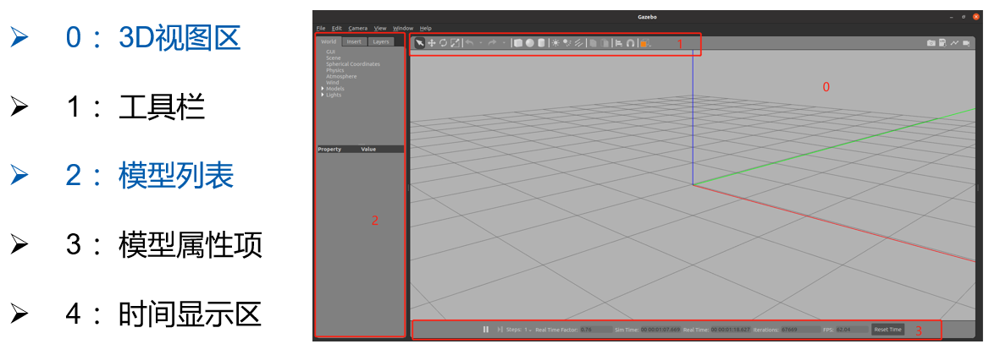

# Gazebo仿真
Gazebo是ROS系统中最为常用的三维物理仿真平台，支持动力学引擎，可以实现高质量的图形渲染，不仅可以模拟机器人及周边环境，还可以加入摩擦力、弹性系数等物理属性。所以类似Gazebo这样的仿真平台，可以帮助我们验证机器人算法、优化机器人设计、测试机器人场景应用，为机器人开发提供更多可能。

## 安装运行
通过命令apt进行安装
```shell
sudo apt install ros-humble-gazebo-*
```
然后通过一下命令可以运行
```shell
 ros2 launch gazebo_ros gazebo.launch.py
```
或者下面的命令
```shell
gazebo --verbose -s libgazebo_ros_init.so -s libgazebo_ros_factory.so 
```
运行之后可以看到如下页面：


为保证模型顺利加载，请将离线模型下载并放置到~/.gazebo/models路径下，下载链接如下：https://github.com/osrf/gazebo_models

## gazebo启动节点与服务
首先查看节点
```shell
ros2 node list
```
正确返回：/gazebo
产看节点的对外提供的服务：ros2 service list。
可以看出如下的结果：
> /delete_entity
/get_model_list
/spawn_entity
/gazebo/describe_parameters
/gazebo/get_parameter_types
/gazebo/get_parameters
/gazebo/list_parameters
/gazebo/set_parameters
/gazebo/set_parameters_atomically

出去最后几个常规的服务，我们只注意前三个特殊的服务：
* /spawn_entity，用于加载模型到gazebo中
* /get_model_list，用于获取模型列表
* /delete_entity，用于删除gazbeo中已经加载的模型

## 创建工作空间及功能包
创建一个gazebo_demo的文件夹，在其中创建一个src文件，然后在src文件夹中创建我们的功能包myrobot(以c++为例)。
```shell
mkdir -p gazebo_demo/src
cd gazebo_demo/src
ros2 pkg create myrobot --build-type ament_camke
```
进入到myrobot的目录下，创建launch、urdf文件夹，修改CMakeLists.txt文件，这一步骤和rviz中类似。在urdf文件夹下创建一个demo01_base.urdf文件，这个文件就是一个简单的演示文件，只有一个基础的立方体。
```xml
<robot name="myrobot">
    <link name="base_link">
        <visual>
            <geometry>
                <box size="0.2 0.2 0.2"/>
            </geometry>
            <origin xyz="0.0 0.0 0.0"/>
        </visual>
        <collision>
            <geometry>
                <box size="0.2 0.2 0.2"/>
            </geometry>
            <origin xyz="0.0 0.0 0.0"/>
        </collision>
        <inertial>
            <mass value="0.1"/>
            <inertia ixx="0.000190416666667" ixy="0" ixz="0" iyy="0.0001904" iyz="0" izz="0.00036"/>
        </inertial>
    </link>
    <gazebo reference="base_link">
        <material>Gazebo/Red</material>
    </gazebo>
</robot>
```
这里和以前的文件不同的是加入了collision和intertial属性，都属于物理相关参数，这个就不做讨论。

## lauch文件
launch文件的编写，launch文件主要启动两个部分，启动Gazebo文件，然后将机器人模型加载到Gazebo中。
```python
start_gazebo_cmd =  ExecuteProcess(
        cmd=['gazebo', '--verbose','-s', 'libgazebo_ros_init.so', '-s', 'libgazebo_ros_factory.so'],
        output='screen')
```
这个命令就是启动Gazebo的，就是一个启动命令，并没有特别复杂的地方，下面是加载模型的命令：
```python
 spawn_entity_cmd = Node(
        package='gazebo_ros', 
        executable='spawn_entity.py',
        arguments=['-entity', robot_name_in_model,  '-file', urdf_model_path ], output='screen')
```
这个命令注意后面两个参数-entity是模型文件中的名字，-file是通过urdf文件加载参数，后面我们还可以看到通过topic话题加载模型的。完整的启动文件如下：
```python
import os
from launch import LaunchDescription
from launch.actions import ExecuteProcess
from launch_ros.actions import Node
from launch_ros.substitutions import FindPackageShare
from launch_ros.parameter_descriptions import ParameterValue
from launch.substitutions import Command

def generate_launch_description():
    robot_name_in_model = 'myrobot'
    package_name = 'myrobot'
    urdf_name = "demo01_base.urdf"
   
    ld = LaunchDescription()
    pkg_share = FindPackageShare(package=package_name).find(package_name) 
    urdf_model_path = os.path.join(pkg_share, f'urdf/{urdf_name}')
   
    # Start Gazebo server
    start_gazebo_cmd =  ExecuteProcess(
        cmd=['gazebo', '--verbose','-s', 'libgazebo_ros_init.so', '-s', 'libgazebo_ros_factory.so'],
        output='screen')

    # Launch the robot
    spawn_entity_cmd = Node(
        package='gazebo_ros', 
        executable='spawn_entity.py',
        arguments=['-entity', robot_name_in_model,  '-file', urdf_model_path ], output='screen')

    ld.add_action(start_gazebo_cmd)
    ld.add_action(spawn_entity_cmd)

    return ld
```
启动之后可以看到如下的Gazebo模型：


可以看到红色的模型，因为最后加上了Gazebo的标签设置。

## 设置自定义的模型文件
通过上面的显示模型文件，可以看出只有空荡荡的模型，我们可以加入一些自定义的环境，例如我们在功能包中新建一个world的文件夹，在其中放入我们的环境模型文件myworld.world。可以通过命令启动文件配置：gazebo --verbose  -s libgazebo_ros_init.so -s  libgazebo_ros_factory.so 你的world文件目录/fishbot.world。就是在原命令的基础上加了个文件路径，效果如下：


## launch文件加载world
上面的文件中，我们已经实现了launch文件启动gazebo并显示机器人模型，但是还存在一些问题，如果文件xacro的话，无法直接通过-file进行读取，所以可以考虑使用-topic命令。我们可以通过 robot_state_publisher_node 将robot_description话题发布出去，这个话题中包含了机器人的模型文件。
```python
    robot_description = ParameterValue(Command(['xacro ', urdf_model_path]),
        value_type=str)
 # 将机器人模型通过robot_description话题发布出去（gazebo好像不能直接加载xacro文件）
    robot_state_publisher_node = Node(
        package='robot_state_publisher',
        executable='robot_state_publisher',
        parameters=[{'robot_description': robot_description}]
    )
```
这部分就和上节课类似，只不过是将模型发布到Gazebo中了，然后下面是更改加载模型的方式了
```python
 spawn_entity_cmd = Node(
        package='gazebo_ros', 
        executable='spawn_entity.py',
        arguments=['-entity', robot_name_in_model,  '-topic', 'robot_description' ], output='screen')
```
注意到使用了-topic的方式，后面加上了话题名称robot_description。启动Gazebo服务的命令后面也要加上我们定义的world模型文件路径。
```python
 start_gazebo_cmd =  ExecuteProcess(
        cmd=['gazebo', '--verbose','-s', 'libgazebo_ros_init.so', '-s', 'libgazebo_ros_factory.so',gazebo_world_path],
        output='screen')
```

最后查看完整的launch文件
```python
import os
from launch import LaunchDescription
from launch.actions import ExecuteProcess
from launch_ros.actions import Node
from launch_ros.substitutions import FindPackageShare
from launch.substitutions import Command
from launch_ros.parameter_descriptions import ParameterValue


def generate_launch_description():
    robot_name_in_model = 'myrobot'
    package_name = 'myrobot'
    urdf_name = "sumcar.xacro"
   

    ld = LaunchDescription()
    pkg_share = FindPackageShare(package=package_name).find(package_name) 
    urdf_model_path = os.path.join(pkg_share, f'urdf/{urdf_name}')
    gazebo_world_path = os.path.join(pkg_share, 'world/myworld.world')

    robot_description = ParameterValue(Command(['xacro ', urdf_model_path]),
    value_type=str)
    # Start Gazebo server
    start_gazebo_cmd =  ExecuteProcess(
        cmd=['gazebo', '--verbose','-s', 'libgazebo_ros_init.so', '-s', 'libgazebo_ros_factory.so',gazebo_world_path],
        output='screen')
        
    # 将机器人模型通过robot_description话题发布出去（gazebo好像不能直接加载xacro文件）
    robot_state_publisher_node = Node(
        package='robot_state_publisher',
        executable='robot_state_publisher',
        parameters=[{'robot_description': robot_description}]
    )

    # Launch the robot
    spawn_entity_cmd = Node(
        package='gazebo_ros', 
        executable='spawn_entity.py',
        arguments=['-entity', robot_name_in_model,  '-topic', 'robot_description' ], output='screen')

    ld.add_action(robot_state_publisher_node)
    ld.add_action(start_gazebo_cmd)
    ld.add_action(spawn_entity_cmd) 

    return ld
```
将以上文件写好后，可以编译运行查看，最终的效果如下：


这个里面蓝色的区域是雷达所能看见的范围，机器人也已经出现在了world区域的中心。