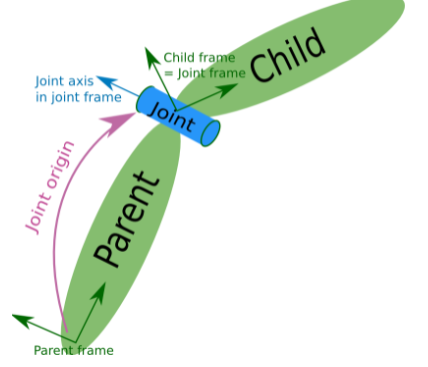

# URDF（Unified Robot Description Format）
统一机器人描述格式，URDF使用XML格式描述机器人文件。通过URDF文件我们可以搭建一个我们自己的仿真机器人，然后通过RVIZ或者Gazebo等软件进行展示，下面进行简单的介绍。
## URDF的基本语法
XML是被设计用来传输和存储数据的可扩展标记语言，注意语言本身是没有含义的，只是规定了其数据格式。与HTML类似，XML也是通过闭合的尖括号组成，但是语法上比HTML语言严谨，下面看一个例子。
```xml
<robot name="myrobot">
    <link name="arm"></link>
    <joint name="body"></joint>
    <link name="leg"></link>
</robot>
```
类似上面就是一个简单的机器人模型文件。
## URDF文件组成
一般情况下，URDF由声明信息和两种关键组件(joint和link)共同组成。
### 声明信息
首先是xml文件的声明信息，这也是所有xml文件必须的，写在文件的第一行。
```xml
<?xml version="1.0"?>
```
接下来是机器人的声明通过一个**robot**标签进行声明，标签中加入name属性。
```xml
<robot name="myrobot">
     <link></link>
     <joint></joint>
</robot>
```
### 两种关键组件(Joint&Link)
一般来说机器人由多种组件组成，例如一个无人车性机器人，由底盘、轮子、雷达等部件，这些组件就是**link**。这些组件与组件进行连接的部分称为**joint**。通过给link和joint标签中的name属性来区别。下面来写一个最基础的base_link标签。
```xml
<!-- base link -->
  <link name="base_link">
      <visual>
        <origin xyz="0 0 0.0" rpy="0 0 0"/>
        <geometry>
            <cylinder length="0.12" radius="0.10"/>
        </geometry>
    </visual>
    <material name="white">
        <color rgba="1.0 1.0 1.0 0.5" /> 
    </material>
  </link>
```
#### link标签
首先看看link标签的组成，首先最基础的是visual标签，用于显示形状，其中也包括了多个标签，首先geometry表示集合形状。可以由多种形状：
* box 长方体 size-长宽高 \<box size="1 1 1"/>

* cylinder 圆柱体，radius-半径，length-高度，\<cylinder radius="1" length="0.5">
* sphere 球体，radius-半径，\<sphere radius="0.015"/>
* mesh:第三方导出的模型文件，filename-文件路径。\<mesh filename="package://robot_pkg/meshes/base_link.DAE"/>

另一个属性是origin，表示偏移量，默认是在物体的集合中心。<origin xyz="0 0 0" rpy="0 0 0" />
* xyz默认为零矢量 
* rpy弧度表示的翻滚、俯仰、偏航

material表示材质，通常用它的颜色属性。color中rgba属性，rgb表示红绿蓝，a表示透明度，军事0-1之间的数字。

剩余还有collision碰撞属性参数，interial惯性参数在仿真中会用到。

#### joint标签
joint称为机器人的关节，用于连接两个机器人部件，要写明父子关系，通常有一下几个功能：父子之间的连接类型，包括是否固定的，可以旋转的等；父部件名字；子部件名字；父子之间相对位置；父子之间的旋转轴，绕哪个轴转……



```xml
<joint name="laser_joint" type="fixed">
    <parent link="base_link" />
    <child link="laser_link" />
    <origin xyz="0 0 0.075" />
    <axis xyz="0 0 1" />
</joint>
```
例如上面的这个关节文件，关节名称是laser_joint，雷达连接的关节，类型type是fixed固定的，父组件是base_link，子组件是laser_link雷达组件，两者的连接在z轴上偏移0.075m。可以绕z轴旋转。joint的type属性可以有多种方式：
* revolute: 旋转关节，绕单轴旋转,角度有上下限,比如舵机0-180
* continuous: 旋转关节，可以绕单轴无限旋转,比如自行车的前后轮
* fixed: 固定关节，不允许运动的特殊关节
* prismatic: 滑动关节，沿某一轴线移动的关节，有位置极限
* planer: 平面关节，允许在xyz，rxryrz六个方向运动
* floating: 浮动关节，允许进行平移、旋转运动

## xacro简化URDF文件
在上面的urdf文件的介绍中存在一些问题，比如各组件的数据都是写好的（轮子半径、机器人高度等），如果要修改其中的数据比较麻烦，而且如果其它数据由轮子半径计算得出，修改轮子半径后，还需要计算后修改其它关联的数据。针对这种问题，可以使用xacro文件。

### 语法介绍
xacro 提供了可编程接口，类似于计算机语言，包括变量声明调用、函数声明与调用等语法实现。在使用 xacro 生成 urdf 时，根标签robot中必须包含命名空间声明:xmlns:xacro="http://wiki.ros.org/xacro"。
也就是文件的第一行要写上：
```xml
<robot name="myrobot" xmlns:xacro="http://wiki.ros.org/xacro">
```
较之于纯粹的 URDF 实现，可以编写更安全、精简、易读性更强的机器人模型文件，且可以提高编写效率。要想展示xacro文件，还需要将xacro文件转为urdf文件，使用xacro xxx.xacro > xxx.urdf，还需要提前安装xacro通过sudo apt install ros-humble-xacro，ros2版本是humble的可以通过以上命令安装。

#### 属性与算数运算
用于封装 URDF 中的一些字段，比如: PAI 值，小车的尺寸，轮子半径 ....
首先定义一个属性：
```xml
<xacro:property name="wheel_radius" value="3" />
```
上面将小车的半径定义为一个属性，需要使用的时候，比如在link中使用，通过${wheel_radius}使用。
```xml
<link name="wheel_link">
    <visual>
        <geometry>
            <cylinder radius="${wheel_radius}" length="${wheel_radius*2}"/>
        </geometry>
    </visual>
</link>
```
上述例子中获取到轮子的半径，然后，还可以进行算数的运算，可以进行加减乘除的运算。

#### 宏定义与调用

```xml
<xacro:macro name="宏名称" params="参数列表(多参数之间使用空格分隔)">
    .....
    参数调用格式: ${参数名}
</xacro:macro>
<!-- 调用格式 -->
xacro:宏名称 参数1=xxx 参数2=xxx/>
```
类似于函数实现，提高代码复用率，优化代码结构，提高安全性，例如小车的左轮和右轮大部分属性都是相同的，只有偏移不同，可以把偏移值放在参数中，然后做一个轮子的宏，从而实现了代码复用。
```xml
<xacro:macro name="wheel_func" params="wheel_name flag">
    <link name="${wheel_name}_wheel">
        <visual>
            <geometry>
                <cylinder radius="0.0325" length="0.015"/>
            </geometry>
            <origin xyz="0.0 0.0 0.0" rpy="${PI/2} 0.0 0.0" />
            <material name="wheel_color">
                <color rgba="0 0 0 0.5"/>
            </material>
        </visual>
    </link>
    <joint name="${wheel_name}2link" type="continuous">
        <parent link="base_link"/>
        <child link="${wheel_name}_wheel"/>
        <!-- 偏移量  x方向无偏移 y偏移车体半径长 z轴：车高/2+离地间距-车轮半径-->
        <origin xyz="0 ${0.1*flag} ${wheel_joint_z}" rpy="0.0 0.0 0.0"/>
        <axis xyz="0 1 0"/>
    </joint>
    </xacro:macro>
<!-- 左右轮子的定义 -->
    <xacro:wheel_func wheel_name="left" flag="1"/>
    <xacro:wheel_func wheel_name="right" flag="-1"/>
```
以上的示例就是两个轮子的代码示例，通过宏定义实现了代码的复用。

#### 文件包含
当所做的工程项目较大的时候，可以将机器人不同部件可能封装为单独的 xacro 文件，最后再将不同的文件集成，组合为完整机器人，可以使用文件包含实现。
```xml
<robot name="xxx" xmlns:xacro="http://wiki.ros.org/xacro">
      <xacro:include filename="my_base.xacro" />
      <xacro:include filename="my_camera.xacro" />
      <xacro:include filename="my_laser.xacro" />
</robot>
```