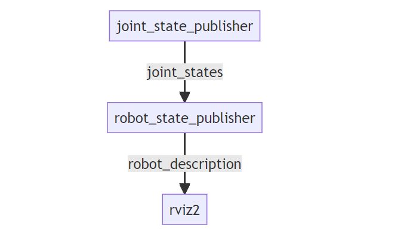
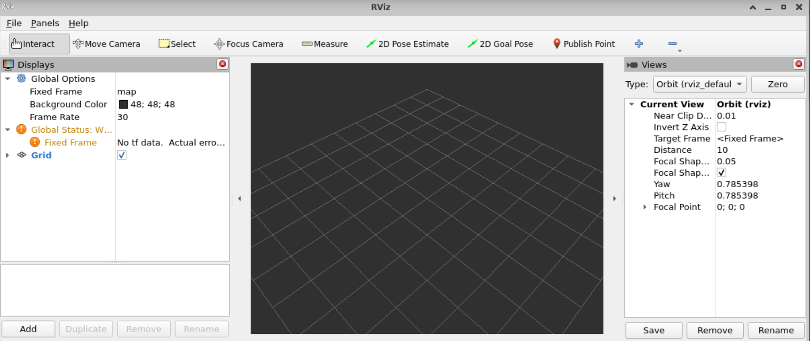
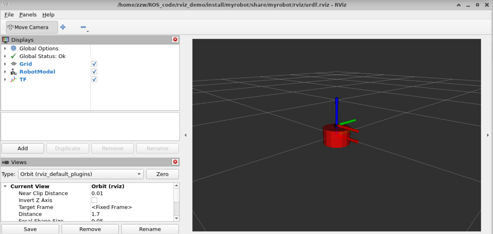

# rviz2显示机器人模型
URDF 不能单独使用，需要结合 Rviz 或 Gazebo，URDF 只是一个文件，需要在 Rviz 或 Gazebo 中渲染成图形化的机器人模型，当前，首先演示URDF与Rviz的集成使用，因为URDF与Rviz的集成较之于URDF与Gazebo的集成更为简单。

## 创建工作空间和功能包
首先创建一个名为**rviz_demo**工作空间，然后创建一个src目录。在src中存放功能包。
```shell
mkdir -p rviz_demo/src
```
创建功能包myrobot(以c++为例)
```shell
cd rviz_demo/src
ros2 pkg create myrobot --build-type ament_camke
```
进入myrobot目录中，在其中创建urdf、launch目录，分别存放urdf文件和启动文件，并在其中分别创建demo01_base.urdf和demo01_launch.py文件，完成之后，总体的文件目录如下
```
├── include
├── launch
│   ├── demo01_launch.py
├── src
└── urdf
    ├── demo01_base.urdf
├── CMakeLists.txt
├── package.xml
```
这样之后，返回工作空间进行编译一下，查看有无错误。
## URDF文件
这里我们就使用之前一个简单的URDF文件作为演示
```xml
<?xml version="1.0"?>
<robot name="myrobot">
  <!-- base link -->
  <link name="base_link">
      <visual>
      <origin xyz="0 0 0.0" rpy="0 0 0"/>
      <geometry>
        <cylinder length="0.12" radius="0.10"/>
      </geometry>
    </visual>
  </link>
    
  <!-- laser link -->
  <link name="laser_link">
      <visual>
      <origin xyz="0 0 0" rpy="0 0 0"/>
      <geometry>
        <cylinder length="0.02" radius="0.02"/>
      </geometry>
      <material name="black">
          <color rgba="0.0 0.0 0.0 0.8" /> 
      </material>
    </visual>
  </link>
  <!-- laser joint -->
    <joint name="laser_joint" type="fixed">
        <parent link="base_link" />
        <child link="laser_link" />
        <origin xyz="0 0 0.075" />
    </joint>
</robot>
```
就简单的两个组件和一个关节，然后修改一下CMakeListx.txt文件，主要是将Launch文件和URDF文件包含在进去。
```txt
install(
  DIRECTORY  launch urdf
  DESTINATION share/${PROJECT_NAME}
)
```

## Launch文件
想要可视化模型需要三个节点参与：
* joint_state_publisher_gui 负责发布机器人关节数据信息，通过joint_states话题发布
* robot_state_publisher_node负责发布机器人模型信息robot_description，并将joint_states数据转换tf信息发布
* rviz2_node负责显示机器人的信息

这三个节点的关系可以如下图所示：


这里我们用到了joint_state_publisher_gui和robot_state_publisher两个包，如果你的系统没有安装这两个包，可以手动安装:
```shell
sudo apt install ros-humble-joint-state-publisher-gui ros-humble-robot-state-publisher
```
joint_state_publisher_gui，还有一个兄弟叫做joint_state_publisher两者区别在于joint_state_publisher_gui运行起来会跳出一个界面，通过界面可以操作URDF中能动的关节。
如下图所示的一个界面


这个例子中我们没有给关节设置能动，所以并没有数据。首先分别看三个节点如何启动配置的。
第一个robot_state_publisher
```python
robot_description = ParameterValue(
    Command(['xacro ', urdf_model_path]),
    value_type=str)
robot_state_publisher_node = Node(
        package='robot_state_publisher',
        executable='robot_state_publisher',
        parameters=[{'robot_description': robot_description}]
        )
```
在这个配置文件中，我们主要注意robot_description这个参数的设置，其实可以不写parameters这一项，直接写
> arguments=[urdf_model_path],

这样写会报一个警告：

> No robot_description parameter, but command-line argument available. Assuming argument is name of URDF file.This backwards compatibility fallback will be removed in the future.

大致意思就是说通过arguents传入urdf文件将会在未来版本中被移除，建议加上robot_description参数。

下面看第二个节点：joint_state_publisher_gui
```python
joint_state_publisher_node = Node(
        package='joint_state_publisher_gui',
        executable='joint_state_publisher_gui',
        name='joint_state_publisher_gui',
        arguments=[urdf_model_path]
        )
```
这里就需要跟上我们urdf文件的路径，当然如果不想要显示界面还可以启动joint_state_publisher节点，把最后的_gui去掉就行了。

最后我们需要启动最后的一个节点rviz节点
```python
 rviz2_node = Node(
        package='rviz2',
        executable='rviz2',
        name='rviz2',
        output='screen',
        arguments=['-d', LaunchConfiguration('rvizconfig')],
        )
```
这里我们就只需要注意最后加上了一个参数，这里我们需要在目录下加上一个rviz目录，里面存放一个urdf.rviz的文件，用于保存rviz的初始配置。因为最开始打开rviz界面的话，是看不到机器人的，如下图所示：


然后我们需要手动添加一些组件才能将我们的机器人显示出来：

例如上图中，我们添加TF和RobotModel组件，然后选组坐标系，才能将最终的机器人进行显示。显示后我们可以将配置进行保存，保存后的文件放在当前目录的rviz文件夹下，通过launch文件的配置，可以初始化我们的rviz图形界面的配置。

完整的launch代码如下。
```python
import os
from launch import LaunchDescription
from launch.substitutions import LaunchConfiguration
from launch_ros.actions import Node
from launch_ros.substitutions import FindPackageShare
from launch.actions import DeclareLaunchArgument
from launch.substitutions import Command
from launch_ros.parameter_descriptions import ParameterValue

def generate_launch_description():
    package_name = 'myrobot'
    urdf_name = "demo01_base.urdf"

    ld = LaunchDescription()
    pkg_share = FindPackageShare(package=package_name).find(package_name) 
    urdf_model_path = os.path.join(pkg_share, f'urdf/{urdf_name}')


    default_rviz_config_path = os.path.join(pkg_share ,'rviz/urdf.rviz')

    robot_description = ParameterValue(Command(['xacro ', urdf_model_path]),
                                       value_type=str)
    
    rviz_arg = DeclareLaunchArgument(name='rvizconfig', default_value=str(default_rviz_config_path),
                                     description='Absolute path to rviz config file')
    
    robot_state_publisher_node = Node(
        package='robot_state_publisher',
        executable='robot_state_publisher',
        parameters=[{'robot_description': robot_description}]
        )

    joint_state_publisher_node = Node(
        package='joint_state_publisher_gui',
        executable='joint_state_publisher_gui',
        name='joint_state_publisher_gui',
        arguments=[urdf_model_path]
        )
    rviz2_node = Node(
        package='rviz2',
        executable='rviz2',
        name='rviz2',
        output='screen',
        arguments=['-d', LaunchConfiguration('rvizconfig')],
        )
    ld.add_action(rviz_arg)
    ld.add_action(joint_state_publisher_node)
    ld.add_action(robot_state_publisher_node)
    ld.add_action(rviz2_node)
    return ld
```
## 测试运行
使用命令编译运行文件
```shell
colcon build
. install/setup.bash
ros2 launch myrobot demo01_launch.py
```
最后的运行结果如下图所示
