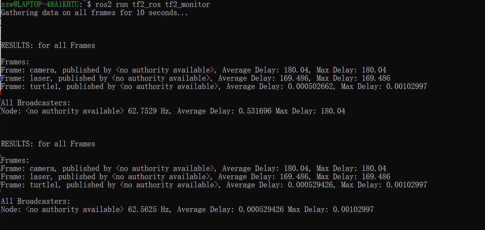
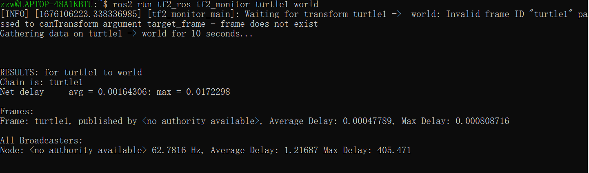
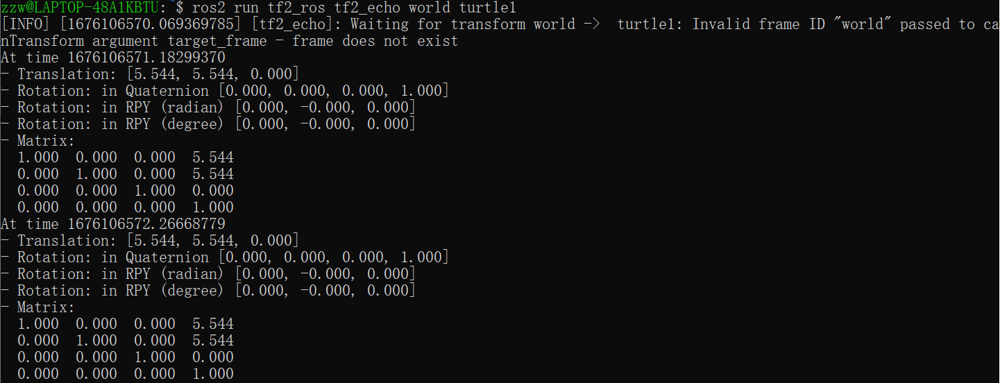
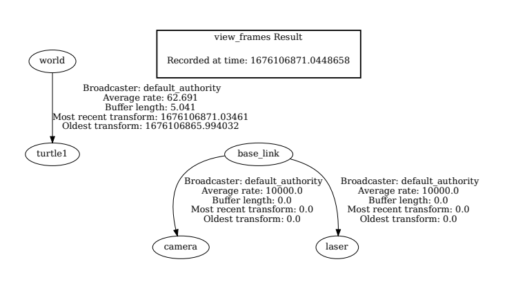

# 坐标变化工具
在ROS2中的TF2框架中除了封装坐标广播与订阅功能之外，还提供了一些工具，可以帮助我们提高开发、调试效率。本节主要介绍这些工具的使用，这些工具主要涉及两个功能包：**tf2_ros**和**tf2_tools**

**tf2_ros**包中提供的常用节点如下：
* static_transform_publisher：该节点用于广播静态坐标变换；
* tf2_monitor：该节点用于打印所有或特定坐标系的发布频率与网络延迟；
* tf2_echo：该节点用于打印特定坐标系的平移旋转关系。

**tf2_tools**包中提供的节点如下：
* view_frames：该节点可以生成显示坐标关系的pdf文件，该文件包含树形结构的坐标系图谱。

## 1、static_transform_publisher
这个命令用于发布静态坐标关系，终端执行命令如下：
```shell
ros2 run tf2_ros static_transform_publisher --frame-id base_link --child-frame-id laser --x 0.4 --z 0.2
```
以上的命令是一个例子，是发布一个静态的坐标变换，父坐标是base_link，子坐标是laser，两个坐标系的相对偏移量是后面的值。

## 2、tf2_monitor
### 2.1、打印所有坐标系的发布频率与网络延迟
终端执行命令:
```shell
ros2 run tf2_ros tf2_monitor
```
这条命令的运行结果大致如下：


也可以监听特定坐标系的关系：下面是监听turtle1和world两个坐标系之间的关系。


## 3、tf2_echo
打印两个坐标系的平移旋转关系。
终端执行命令：
```shell
ros2 run tf2_ros tf2_echo world turtle1
```
运行结果如下图所示：


## 3、view_frames
以图形化的方式显示坐标系关系，终端执行命令
```shell
ros2 run tf2_tools view_frames
```
运行结果：将会生成frames_xxx.gv和frames_xxx.pdf文件，其中xxx为时间戳。直接打开pdf文件可以看到类似下图的坐标树。
