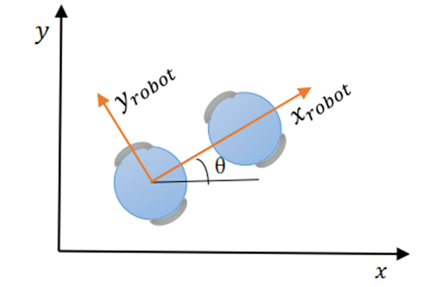
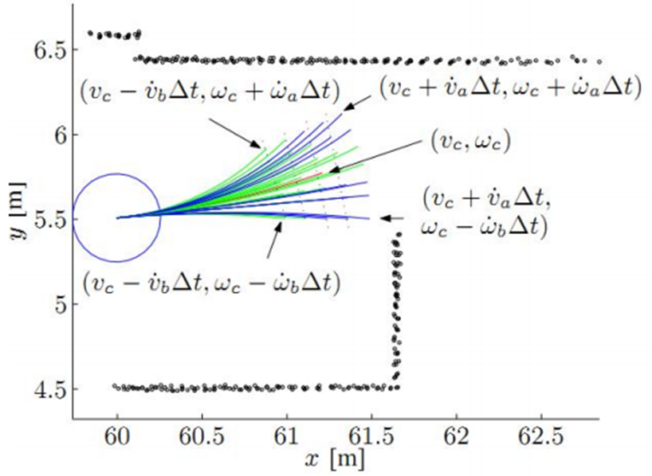

# DWA——Dynamic Window Approach动态窗口法
## 发展
动态窗口法是一种**局部路径规划**算法，起源于对移动机器人在复杂环境中实时避障的需求。该算法由F. D. Proentzen和O. Khatib提出，后经过不断优化，已成为移动机器人领域中的标准算法之一。
## 运动模型
通过在速度空间内采样，预测在不同速度下的轨迹，并使用评价函数来评估这些轨迹。选择评价最高的轨迹对应的速度作为机器人的下一个运动指令。

### 差速模型
差速模型小车不能全向移动，只能前进(x轴线速度v)，和旋转(z轴角速度w)，如差速车如下图所示。小车相邻时刻内（ms级），运动距离短，可将相邻两点之间的运动轨迹，看成直线。



小车在$\Delta t$时间内走了多远：$\Delta s = v*\Delta t $，变成小车的$ x,y $坐标为：
$$
\Delta x = v \Delta tcos(\theta_t)

\\

\Delta y = v \Delta tsin(\theta_t)
$$
那么小车的下个状态的位置为：
$$
x = x + v \Delta tcos(\theta_t)

\\

y = y + v \Delta tsin(\theta_t)

\\

\theta_t = \theta_t+\omega \Delta t 
$$

### 全向模型
如果小车是全向移动的，有$v_x$、$v_y$和$\omega$，如麦克纳姆轮小车。小车相邻时刻内（ms级），运动距离短，可将相邻两点之间的运动轨迹，看成直线。

那么由y方向速度 产生小车的x,y坐标变化为：
$$
\Delta x_y = - v_y \Delta t sin(\theta_t)

\\

\Delta y_y =  v_y \Delta t cos(\theta_t)
$$
同理由x方向速度 产生小车的x,y坐标变化为：
$$
\Delta x_x = v_x \Delta t cos(\theta_t)

\\

\Delta y_x = v_x \Delta t sin(\theta_t)
$$
所以小车下个状态的位置为：
$$
x = x +  v_x \Delta t cos(\theta_t)- v_y \Delta t sin(\theta_t)

\\

y = y +  v_x \Delta t sin(\theta_t)+ v_y \Delta t cos(\theta_t)

\\

\theta_t = \theta_t+\omega\Delta_t
$$
### 其他模型
运动轨迹看成弧线

## 速度采样
有了运动模型，根据速度就可以推算出轨迹。因此只需采样很多速度，推算轨迹，然后评价这些轨迹好不好，选择当中的最优解。那么就要考虑速度如何采样？速度的范围？小车本身的限制？

我们通常从以下几个方面来考虑的：1、小车速度最大值、最小值；2、电机性能影响加速度；3、预留刹车距离。根据这几个方面确定速度范围之后，我们就需要进行速度的采样。

假如小车的速度和角速度范围是：$v_x \in (5,20),\omega \in (0.1,1)$，那么接下来就需要对速度进行离散化，例如可以将速度的分辨率设置为0.1，角速度的分辨率设置为0.05，那么
$$
v_x = 5.1/5.2/5.3...

\\

\omega = 0.15/0.20/0.25...
$$
接下来利用速度和小车的运动学模型，就可以模拟推算出一段时间内小车的路径如下图所示。


## 评价函数
如上图所示，得到多条路径之后，如何选择出一条最优的路径？或者说如何评价每一条路径的好坏？我们可以定义一个评价函数。
$$
G(v,\omega) = \sigma(\alpha \cdot heading(v,\omega) + \beta \cdot dist(v,\omega) +  \gamma \cdot velocity(v,\omega))
$$
上述公式中，$heading(v,\omega)$为：方位角评价函数，小车与目标之间的角度差，原文用180-θ评价。$dist(v,\omega)$小车与最近障碍物之间的距离，$velocity(v,\omega)$轨迹对应的速度大小。

那么上述公式的物理意义为使小车避开障碍物、朝着目标、以较快的速度行驶。

其中为了避免不同单位之间量纲的误差，对其进行归一化，每一项除以每一项的总和。
$$
normal_head(i) = \frac{head(i)}{\sum_{i=1}^{n}head(i)}

\\

normal_dist(i) = \frac{dist(i)}{\sum_{i=1}^{n} dist(i)}

\\

normal_velocity(i) = \frac{velocity(i)}{\sum_{i=1}^{n} velocity(i)}
$$
还有就是三个权重$\alpha、\beta、\gamma$，可以根据实际情况进行调节，影响小车选取路径。

## 总体流程

```

初始化——小车最大最小速度、加速度，评价函数权重等
循环
{	判断是否到达目的地

    计算当前采样的速度范围（动态窗口）

    遍历所有速度v & w，根据模型模拟一段时间的路径

    根据评价函数打分（包括评价函数、归一化、权重）
	选取最优解——v & w，下发给运动底盘

    小车继续移动
}

```

## 代码
``` matlab
% -------------------------------------------------------------------------
%
% File : DWA
%
% Discription : Mobile Robot Motion Planning with Dynamic Window Approach
%
% Environment : Matlab
%
% Author :zzw
%
%
% License : Modified BSD Software License Agreement
% log: collision checking 修改为硬约束
% -------------------------------------------------------------------------
 
function [] = dwa_V_1_0()

close all;
clear ;

disp('Dynamic Window Approach sample program start!!')

%% 机器人的初期状态[x(m),y(m),yaw(Rad),v(m/s),w(rad/s)]
% x=[0 0 pi/2 0 0]'; % 5x1矩阵 列矩阵  位置 0，0 航向 pi/2 ,速度、角速度均为0
x = [0 0 pi/10 0 0]'; 

% 下标宏定义 状态[x(m),y(m),yaw(Rad),v(m/s),w(rad/s)]
POSE_X      = 1;  %坐标 X
POSE_Y      = 2;  %坐标 Y
YAW_ANGLE   = 3;  %机器人航向角
V_SPD       = 4;  %机器人速度
W_ANGLE_SPD = 5;  %机器人角速度 

goal = [10,10];   % 目标点位置 [x(m),y(m)]

% 障碍物位置列表 [x(m) y(m)]

obstacle=[%0 2;
          3 10*rand(1);
%           4 4;
%          5 4;
%            5 5;
          6 10*rand(1);
%          5 9
%          7 8
          8 10*rand(1);
          2 5;      
          4 2;
          7 7;
          9 9
            ];
%边界障碍物，防止跑出图外
 for i =-1
    for j = -1:12
        obstacle = [obstacle; [i,j]];
    end
 end     
for i =12
    for j = -1:12
        obstacle = [obstacle; [i,j]];
    end
end 
for j =-2
    for i = -1:12
        obstacle = [obstacle; [i,j]];
    end
end 
for j=13
    for i= -1:12
        obstacle = [obstacle; [i,j]];
    end
end 
 
obstacleR = 0.5;% 冲突判定用的障碍物半径
global dt; 
dt = 0.1;% 时间[s]

% 机器人运动学模型参数
% 最高速度m/s],最高旋转速度[rad/s],加速度[m/ss],旋转加速度[rad/ss],
% 速度分辨率[m/s],转速分辨率[rad/s]]
Kinematic = [1.0,toRadian(20.0),0.2,toRadian(50.0),0.01,toRadian(1)];
%定义Kinematic的下标含义
MD_MAX_V    = 1;%   最高速度m/s]
MD_MAX_W    = 2;%   最高旋转速度[rad/s]
MD_ACC      = 3;%   加速度[m/ss]
MD_VW       = 4;%   旋转加速度[rad/ss]
MD_V_RESOLUTION  = 5;%  速度分辨率[m/s]
MD_W_RESOLUTION  = 6;%  转速分辨率[rad/s]]


% 评价函数参数 [heading,dist,velocity,predictDT]
% 航向得分的比重、距离得分的比重、速度得分的比重、向前模拟轨迹的时间
evalParam = [0.045, 0.1 ,0.1, 3.0];
% evalParam = [2, 0.2 ,0.2, 3.0];
area      = [-3 14 -3 14];% 模拟区域范围 [xmin xmax ymin ymax]

% 模拟实验的结果
result.x=[];   %累积存储走过的轨迹点的状态值
tic; % 估算程序运行时间开始
flag_obstacle = [1-2*rand(1) 1-2*rand(1) 1-2*rand(1)];
vel_obstacle = 0.05;
temp = 0;
abc = 0;
%movcount=0;
%% Main loop   循环运行 5000次 指导达到目的地 或者 5000次运行结束
for i = 1:5000  
    % DWA参数输入 返回控制量 u = [v(m/s),w(rad/s)] 和 轨迹
    [u,traj] = DynamicWindowApproach(x,Kinematic,goal,evalParam,obstacle,obstacleR);%算出下发速度u/当前速度u
    x = f(x,u);% 机器人移动到下一个时刻的状态量 根据当前速度和角速度推导 下一刻的位置和角度
    abc = abc+1;
    % 历史轨迹的保存
    result.x = [result.x; x'];  %最新结果 以行的形式 添加到result.x，保存的是所有状态参数值，包括坐标xy、朝向、线速度、角速度，其实应该是只取坐标就OK
    
    % 是否到达目的地
    if norm(x(POSE_X:POSE_Y)-goal')<0.25   % norm函数来求得坐标上的两个点之间的距离
        disp('==========Arrive Goal!!==========');break;
    end
    
    %====Animation====
    hold off;               % 关闭图形保持功能。 新图出现时，取消原图的显示。
    ArrowLength = 0.5;      % 箭头长度
    
    % 机器人
    % quiver(x,y,u,v) 在 x 和 y 中每个对应元素对组所指定的坐标处将向量绘制为箭头
    quiver(x(POSE_X), x(POSE_Y), ArrowLength*cos(x(YAW_ANGLE)), ArrowLength*sin(x(YAW_ANGLE)),'ok'); 
    % 绘制机器人当前位置的航向箭头
    hold on;                                                     
    %启动图形保持功能，当前坐标轴和图形都将保持，从此绘制的图形都将添加在这个图形的基础上，并自动调整坐标轴的范围
    
    plot(result.x(:,POSE_X),result.x(:,POSE_Y),'-b');hold on;    % 绘制走过的所有位置 所有历史数据的 X、Y坐标
    plot(goal(1),goal(2),'*r');hold on;                          % 绘制目标位置

    for j = 1:3
        if obstacle(j,2) > 10 && flag_obstacle(j) > 0 || obstacle(j,2) < 0 && flag_obstacle(j) < 0
            flag_obstacle(j) = -flag_obstacle(j);
        end
%        obstacle(j,2)=obstacle(j,2)+flag_obstacle(j)*vel_obstacle;
    end
    
    %plot(obstacle(:,1),obstacle(:,2),'*k');hold on;              % 绘制所有障碍物位置
    DrawObstacle_plot(obstacle,obstacleR);
    
    % 探索轨迹 画出待评价的轨迹
    if ~isempty(traj) %轨迹非空
        for it=1:length(traj(:,1))/5    %计算所有轨迹数  traj 每5行数据 表示一条轨迹点
            ind = 1+(it-1)*5; %第 it 条轨迹对应在traj中的下标 
            plot(traj(ind,:),traj(ind+1,:),'-g');hold on;  %根据一条轨迹的点串画出轨迹   traj(ind,:) 表示第ind条轨迹的所有x坐标值  traj(ind+1,:)表示第ind条轨迹的所有y坐标值
        end
    end
    
    axis(area); %根据area设置当前图形的坐标范围，分别为x轴的最小、最大值，y轴的最小最大值
    grid on;
    drawnow limitrate;  %刷新屏幕. 当代码执行时间长，需要反复执行plot时，Matlab程序不会马上把图像画到figure上，这时，要想实时看到图像的每一步变化情况，需要使用这个语句。
    for j = 1:3
        if norm(obstacle(j,:)-x(1:2)')-obstacleR < 0
           disp('==========Hit an obstacle!!==========');
           temp = 1;
           break;
        end
    end
    if temp == 1
        break;
    end
   % movcount = movcount+1;
   % mov(movcount) = getframe(gcf);%  记录动画帧
end
toc;  %输出程序运行时间  形式：时间已过 ** 秒。
disp(abc)
%movie2avi(mov,'movie.avi');  %录制过程动画 保存为 movie.avi 文件

%% 绘制所有障碍物位置
% 输入参数：obstacle 所有障碍物的坐标   obstacleR 障碍物的半径
function [] = DrawObstacle_plot(obstacle,obstacleR)
r = obstacleR; 
theta = 0:pi/20:2*pi;
for id=1:length(obstacle(:,1))
 x = r * cos(theta) + obstacle(id,1); 
 y = r  *sin(theta) + obstacle(id,2);
 plot(x,y,'-m'); 
end
 %plot(obstacle(:,1),obstacle(:,2),'*m');hold on;              % 绘制所有障碍物位置

%% DWA算法实现 
% model  机器人运动学模型  最高速度[m/s],最高旋转速度[rad/s],加速度[m/ss],旋转加速度[rad/ss], 速度分辨率[m/s],转速分辨率[rad/s]]
% 输入参数：当前状态、模型参数、目标点、评价函数的参数、障碍物位置、障碍物半径
% 返回参数：控制量 u = [v(m/s),w(rad/s)] 和 轨迹集合 N * 31  （N：可用的轨迹数）
% 选取最优参数的物理意义：在局部导航过程中，使得机器人避开障碍物，朝着目标以较快的速度行驶。
function [u,trajDB] = DynamicWindowApproach(x,model,goal,evalParam,ob,R)
% Dynamic Window [vmin,vmax,wmin,wmax] 最小速度 最大速度 最小角速度 最大角速度速度
Vr = CalcDynamicWindow(x,model);  % 根据当前状态 和 运动模型 计算当前的参数允许范围

% 评价函数的计算 evalDB N*5  每行一组可用参数 分别为 速度、角速度、航向得分、距离得分、速度得分
%               trajDB      每5行一条轨迹 每条轨迹都有状态x点串组成
[evalDB,trajDB]= Evaluation(x,Vr,goal,ob,R,model,evalParam);  %evalParam 评价函数参数 [heading,dist,velocity,predictDT]

if isempty(evalDB)
    disp('no path to goal!!');
    u=[0;0];return;
end

% 各评价函数正则化
evalDB = NormalizeEval(evalDB);

% 最终评价函数的计算
feval=[];
for id=1:length(evalDB(:,1))
    feval = [feval;evalParam(1:3)*evalDB(id,3:5)']; %根据评价函数参数 前三个参数分配的权重 计算每一组可用的路径参数信息的得分
end
evalDB = [evalDB feval]; % 最后一组；加最后一列，每一组速度的最终得分
 
[maxv,ind] = max(feval);% 选取评分最高的参数 对应分数返回给 maxv  对应下标返回给 ind
u = evalDB(ind,1:2)';% 返回最优参数的速度、角速度  

%% 评价函数 内部负责产生可用轨迹
% 输入参数 ：当前状态、参数允许范围（窗口）、目标点、障碍物位置、障碍物半径、评价函数的参数
% 返回参数：
%           evalDB N*5  每行一组可用参数 分别为 速度、角速度、航向得分、距离得分、速度得分
%           trajDB      每5行一条轨迹 每条轨迹包含 前向预测时间/dt + 1 = 31 个轨迹点（见生成轨迹函数）
function [evalDB,trajDB] = Evaluation(x,Vr,goal,ob,R,model,evalParam)
evalDB = [];
trajDB = [];
for vt = Vr(1):model(5):Vr(2)       %根据速度分辨率遍历所有可用速度： 最小速度和最大速度 之间 速度分辨率 递增 
    for ot=Vr(3):model(6):Vr(4)     %根据角度分辨率遍历所有可用角速度： 最小角速度和最大角速度 之间 角度分辨率 递增  
        % 轨迹推测; 得到 xt: 机器人向前运动后的预测位姿; traj: 当前时刻 到 预测时刻之间的轨迹（由轨迹点组成）
        [xt,traj] = GenerateTrajectory(x,vt,ot,evalParam(4));  %evalParam(4),前向模拟时间;
        % 各评价函数的计算
        heading = CalcHeadingEval(xt,goal); % 前项预测终点的航向得分  偏差越小分数越高
        [dist,Flag] = CalcDistEval(xt,ob,R);    % 前项预测终点 距离最近障碍物的间隙得分 距离越远分数越高
        vel     = abs(vt);                  % 速度得分 速度越快分越高
        stopDist = CalcBreakingDist(vel,model); % 制动距离的计算
        if dist > stopDist && Flag == 0 % 如果可能撞到最近的障碍物 则舍弃此路径 （到最近障碍物的距离 大于 刹车距离 才取用）
            evalDB = [evalDB;[vt ot heading dist vel]];
            trajDB = [trajDB;traj];   % 每5行 一条轨迹  
        end
    end
end

%% 归一化处理 
% 每一条轨迹的单项得分除以本项所有分数和
function EvalDB=NormalizeEval(EvalDB)
% 评价函数正则化
if sum(EvalDB(:,3))~= 0
    EvalDB(:,3) = EvalDB(:,3)/sum(EvalDB(:,3));  %矩阵的数除  单列矩阵的每元素分别除以本列所有数据的和
end
if sum(EvalDB(:,4))~= 0
    EvalDB(:,4) = EvalDB(:,4)/sum(EvalDB(:,4));
end
if sum(EvalDB(:,5))~= 0
    EvalDB(:,5) = EvalDB(:,5)/sum(EvalDB(:,5));
end

%% 单条轨迹生成、轨迹推演函数
% 输入参数： 当前状态、vt当前速度、ot角速度、evaldt 前向模拟时间、机器人模型参数（没用到）
% 返回参数; 
%           x   : 机器人模拟时间内向前运动 预测的终点位姿(状态); 
%           traj: 当前时刻 到 预测时刻之间 过程中的位姿记录（状态记录） 当前模拟的轨迹  
%                  轨迹点的个数为 evaldt / dt + 1 = 3.0 / 0.1 + 1 = 31
%           
function [x,traj] = GenerateTrajectory(x,vt,ot,evaldt)
global dt;
time = 0;
u = [vt;ot];% 输入值
traj = x;   % 机器人轨迹
while time <= evaldt   
    time = time+dt; % 时间更新
    x = f(x,u);     % 运动更新 前项模拟时间内 速度、角速度恒定
    traj = [traj x]; % 每一列代表一个轨迹点 一列一列的添加
end

%% 计算制动距离 
%根据运动学模型计算制动距离, 也可以考虑成走一段段圆弧的累积 简化可以当一段段小直线的累积
function stopDist = CalcBreakingDist(vel,model)
global dt;
MD_ACC   = 3;% 
stopDist=0;
while vel>0   %给定加速度的条件下 速度减到0所走的距离
    stopDist = stopDist + vel*dt;% 制动距离的计算 
    vel = vel - model(MD_ACC)*dt;% 
end

%% 障碍物距离评价函数  （机器人在当前轨迹上与最近的障碍物之间的距离，如果没有障碍物则设定一个常数）
% 输入参数：位姿、所有障碍物位置、障碍物半径
% 输出参数：当前预测的轨迹终点的位姿距离所有障碍物中最近的障碍物的距离 如果大于设定的最大值则等于最大值
% 距离障碍物距离越近分数越低
function [dist,Flag] = CalcDistEval(x,ob,R)
dist=100;
for io = 1:length(ob(:,1))  
    disttmp = norm(ob(io,:)-x(1:2)')-R; %到第io个障碍物的距离 - 障碍物半径  ！！！有可能出现负值吗
    if disttmp <0
        Flag = 1;
        break;
    else
        Flag = 0;
    end
    
    if dist > disttmp   % 大于最小值 则选择最小值
        dist = disttmp;
    end
end
 
% 障碍物距离评价限定一个最大值，如果不设定，一旦一条轨迹没有障碍物，将太占比重
if dist >= 3*R %最大分数限制
    dist = 3*R;
end
 
%% heading的评价函数计算
% 输入参数：当前位置、目标位置
% 输出参数：航向参数得分  当前车的航向和相对于目标点的航向 偏离程度越小 分数越高 最大180分
function heading = CalcHeadingEval(x,goal)
theta = toDegree(x(3));% 机器人朝向
goalTheta = toDegree(atan2(goal(2)-x(2),goal(1)-x(1)));% 目标点相对于机器人本身的方位 
if goalTheta > theta
    targetTheta = goalTheta-theta;% [deg]
else
    targetTheta = theta-goalTheta;% [deg]
end
 
heading = 180 - targetTheta;  

%% 计算动态窗口
% 返回 最小速度 最大速度 最小角速度 最大角速度速度
function Vr = CalcDynamicWindow(x,model)

V_SPD       = 4;%机器人速度
W_ANGLE_SPD = 5;%机器人角速度 

MD_MAX_V = 1;% 
MD_MAX_W = 2;% 
MD_ACC   = 3;% 
MD_VW    = 4;% 

global dt;
% 车子速度的最大最小范围 依次为：最小速度 最大速度 最小角速度 最大角速度速度
Vs=[0 model(MD_MAX_V) -model(MD_MAX_W) model(MD_MAX_W)];
 
% 根据当前速度以及加速度限制计算的动态窗口  依次为：最小速度 最大速度 最小角速度 最大角速度速度
Vd = [x(V_SPD)-model(MD_ACC)*dt x(V_SPD)+model(MD_ACC)*dt ...
    x(W_ANGLE_SPD)-model(MD_VW)*dt x(W_ANGLE_SPD)+model(MD_VW)*dt];
 
% 最终的Dynamic Window
Vtmp = [Vs;Vd];  %2 X 4  每一列依次为：最小速度 最大速度 最小角速度 最大角速度速度
Vr = [max(Vtmp(:,1)) min(Vtmp(:,2)) max(Vtmp(:,3)) min(Vtmp(:,4))];
 
%% Motion Model 根据当前状态推算下一个控制周期（dt）的状态
% u = [vt; wt];当前时刻的速度、角速度 x = 状态[x(m),y(m),yaw(Rad),v(m/s),w(rad/s)]
function x = f(x, u)
global dt;
F = [1 0 0 0 0
     0 1 0 0 0
     0 0 1 0 0
     0 0 0 0 0
     0 0 0 0 0];
 
B = [dt*cos(x(3)) 0
    dt*sin(x(3)) 0
    0 dt
    1 0
    0 1];
 
x= F*x+B*u;  

%% degree to radian
function radian = toRadian(degree)
radian = degree/180*pi;

%% radian to degree
function degree = toDegree(radian)
degree = radian/pi*180;
%% END


```