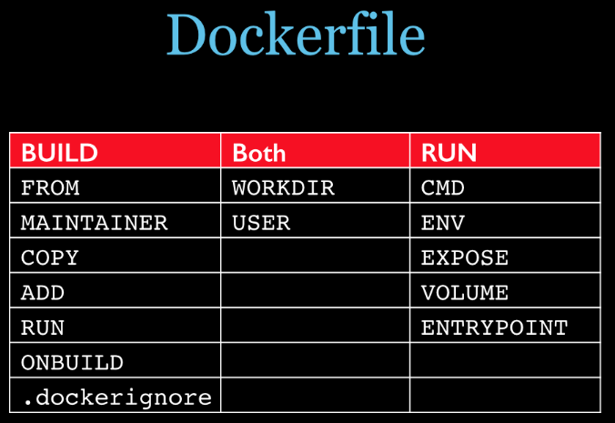

# Docker

## 安装

* 使用get docker安装（比较简单）
```sh
sudo apt install curl
curl -fsSL https://get.docker.com -o get-docker.sh
sudo sh get-docker.sh
```

* 使用官网教程安装（推荐，可以了解细节）
```shell
# Add Docker's official GPG key:
sudo apt-get update
sudo apt-get install ca-certificates curl
sudo install -m 0755 -d /etc/apt/keyrings
sudo curl -fsSL https://download.docker.com/linux/ubuntu/gpg -o /etc/apt/keyrings/docker.asc
sudo chmod a+r /etc/apt/keyrings/docker.asc

# Add the repository to Apt sources:
echo \
  "deb [arch=$(dpkg --print-architecture) signed-by=/etc/apt/keyrings/docker.asc] https://download.docker.com/linux/ubuntu \
  $(. /etc/os-release && echo "$VERSION_CODENAME") stable" | \
  sudo tee /etc/apt/sources.list.d/docker.list > /dev/null
sudo apt-get update
sudo apt-get install docker-ce docker-ce-cli containerd.io docker-buildx-plugin docker compose-plugin
```
* 镜像安装
由于国内网络的问题，可能导致安装失败，推荐使用[阿里云镜像安装](https://developer.aliyun.com/mirror/docker-ce)
```shell
# step 1: 安装必要的一些系统工具
sudo apt-get update
sudo apt-get -y install apt-transport-https ca-certificates curl software-properties-common
# step 2: 安装GPG证书
curl -fsSL https://mirrors.aliyun.com/docker-ce/linux/ubuntu/gpg | sudo apt-key add -
# Step 3: 写入软件源信息
sudo add-apt-repository "deb [arch=$(dpkg --print-architecture)] https://mirrors.aliyun.com/docker-ce/linux/ubuntu $(lsb_release -cs) stable"
# Step 4: 更新并安装Docker-CE
sudo apt-get -y update
sudo apt-get -y install docker-ce

# 安装指定版本的Docker-CE:
# Step 1: 查找Docker-CE的版本:
# apt-cache madison docker-ce
#   docker-ce | 17.03.1~ce-0~ubuntu-xenial | https://mirrors.aliyun.com/docker-ce/linux/ubuntu xenial/stable amd64 Packages
#   docker-ce | 17.03.0~ce-0~ubuntu-xenial | https://mirrors.aliyun.com/docker-ce/linux/ubuntu xenial/stable amd64 Packages
# Step 2: 安装指定版本的Docker-CE: (VERSION例如上面的17.03.1~ce-0~ubuntu-xenial)
# sudo apt-get -y install docker-ce=[VERSION]
```

验证是否安装完成：

```sh
docker -v
```


## 查看已有镜像

```sh
docker images
```

## 其他镜像操作

搜索镜像：

```sh
docker search <镜像名称>
```

删除镜像（删除镜像需要保证没有对应的容器）：

```sh
docker rmi <镜像名称:标签>
```

## 基于镜像启动容器

```sh
docker run -d [-p <主机端口>:<容器端口>] [--name=<容器名称>] [-v <宿主机路径>:<容器路径>] [--restart=<重启值>] <镜像名称>
```

- `-d` 表示在后台运行
- `-p` 表示将主机的端口映射到容器的端口，注意主机的端口不能被占用，可以通过 `sudo lsof -i:<端口号>` 查看端口是否被占用，注意关闭防火墙或者防火墙开放对应的端口，否则其他机器无法访问
- `--name` 指定创建的容器名称，如果不指定会自动创建
- `-v` （Volume 数据卷）用于将宿主机的文件夹/文件映射到容器，相当于共享文件夹，常用于映射配置文件、日志目录、数据库等

- `--restart` 表示容器何时重启，常见的值有：
  - `no`：不重启
  - `on-failure`：容器异常停止时会重启
  - `unless-stopped`：除非手动停止，否则一直重启
  - `always`：无论何时服务停止，都自动重启，即使手动停止

## 容器其他操作

查看正在运行的容器：

```sh
docker ps
```

查看所有容器：

```sh
docker ps -a
```

运行/停止容器：

```sh
docker start <容器名或容器ID>
docker stop <容器名或容器ID>
```

删除容器（删除容器前需要先停止）：

```sh
docker rm <容器名或容器ID>
```

查看容器日志：

```sh
docker logs <容器名或容器ID>
```

以交互模式运行容器：

```sh
docker run -it <容器名称> [bash]
```

在正在运行的容器中执行命令：

```sh
docker exec -it <容器名称或容器ID> <命令>
docker exec -it <容器名称或容器ID> /bin/bash # 在docker容器打开命令行
```

## 导出

```sh
docker save -o <导出文件名.tar> <镜像名称>
```

默认会导出到当前文件夹

## 导入

```sh
docker load -i <文件名.tar>
```

## Dockerfile

是一个文件，无后缀名，使用一些保留字来构建一个Docker镜像
### 常见的保留字

* FROM : 基础镜像，当前新镜像是基于哪个镜像的，指定一个已经存在的镜像作为模板，第一条必须是from
* MAINTAINER : 镜像维护者的姓名和邮箱地址
* RUN: 容器构建时需要运行的指令，docker build时运行有两种格式
```
shell格式：RUN yum -y install vim
exec格式：RUN ["可执行文件","参数1","参数2"]
```

* EXPOSE : 当前容器对外暴露出的端口
* WORKDIR ：指定在创建容器后，终端默认登陆的进来工作目录，一个落脚点
* USER ：指定该镜像以什么样的用户去执行，如果都不指定，默认是root
* ENV ：用来在构建镜像过程中设置环境变量```ENV MY_PATH /usr/mypath```
* ADD : 将宿主机目录下的文件拷贝进镜像且会自动处理URL和解压tar压缩包
* COPY : 类似ADD，拷贝文件和目录到镜像中。
将从构建上下文目录中 <源路径> 的文件/目录复制到新的一层的镜像内的 <目标路径> 位置
* VOLUME : 容器数据卷，用于数据保存和持久化工作
* CMD : 指定容器启动后的要干的事情，与RUN命令格式类似
* ENTRYPOINT ：也是用来指定一个容器启动时要运行的命令，类似于 CMD 指令，但是ENTRYPOINT不会被docker run后面的命令覆盖，
而且这些命令行参数会被当作参数送给 ENTRYPOINT 指令指定的程序



```dockerfile
# 自定义一个java8的镜像
 
FROM centos
MAINTAINER zzyy<zzyybs@126.com>
 
ENV MYPATH /usr/local
WORKDIR $MYPATH
 
#安装vim编辑器
RUN yum -y install vim
#安装ifconfig命令查看网络IP
RUN yum -y install net-tools
#安装java8及lib库
RUN yum -y install glibc.i686
RUN mkdir /usr/local/java
#ADD 是相对路径jar,把jdk-8u171-linux-x64.tar.gz添加到容器中,安装包必须要和Dockerfile文件在同一位置
ADD jdk-8u171-linux-x64.tar.gz /usr/local/java/
#配置java环境变量
ENV JAVA_HOME /usr/local/java/jdk1.8.0_171
ENV JRE_HOME $JAVA_HOME/jre
ENV CLASSPATH $JAVA_HOME/lib/dt.jar:$JAVA_HOME/lib/tools.jar:$JRE_HOME/lib:$CLASSPATH
ENV PATH $JAVA_HOME/bin:$PATH
 
EXPOSE 80
 
CMD echo $MYPATH
CMD echo "success--------------ok"
CMD /bin/bash
 

```

## 构建镜像

进入到项目目录，运行以下命令构建 Docker 镜像，命令最后有一个点“.”

```sh
docker build -t <镜像名称>:TAG .
```

其中 `.` 表示使用当前目录下的 Dockerfile 文件进行构建。

## Docker Compose

Docker Compose 用于定义和管理多个 docker 容器

安装 Docker Compose，目前安装Docker的使用都已经安装了Docker Compose，而且命令由原来的```docker compose```变为现在的```docker compose```，如果是较老版本的Docker可以参考一下命令安装

```sh
# 可能需要梯子或者多尝试几次
sudo curl -L "https://github.com/docker/compose/releases/download/1.29.2/docker compose-$(uname -s)-$(uname -m)" -o /usr/local/bin/docker compose
sudo chmod +x /usr/local/bin/docker compose
```

验证安装是否完成（可能需要重启）：

```sh
docker compose -version
```

### Docker Compose常用命令
```shell
docker compose -h                           # 查看帮助
docker compose up                           # 启动所有docker compose服务
docker compose up -d                        # 启动所有docker compose服务并后台运行
docker compose down                         # 停止并删除容器、网络、卷、镜像。
docker compose exec  yml里面的服务id                 # 进入容器实例内部  docker compose exec docker compose.yml文件中写的服务id /bin/bash
docker compose ps                      # 展示当前docker compose编排过的运行的所有容器
docker compose top                     # 展示当前docker compose编排过的容器进程
 
docker compose logs  yml里面的服务id     # 查看容器输出日志
docker compose config     # 检查配置
docker compose config -q  # 检查配置，有问题才有输出
docker compose restart   # 重启服务
docker compose start     # 启动服务
docker compose stop      # 停止服务
 

```

编写 `docker compose.yml` 配置文件：

```yaml
version: '3'

services:
  nginx-service:
    build:
      context: ./nginx-service
    image: nginx-service:latest
    container_name: nginx-service
    ports:
      - '80:80'
    # network_mode: host
    restart: unless-stopped
    volumes:
      - ./nginx-service/log:/var/log/nginx

  node-service:
    build:
      context: ./node-service
    image: node-service:latest
    container_name: node-service
    ports:
      - '3000:3000'
    # network_mode: host
    restart: unless-stopped
```

容器间通信：

- docker 容器的 `network_mode` 默认为 `bridge`，即容器桥接到宿主机，不同容器间通过 IP 或者服务名称进行通信，例如：nginx 服务可以通过将接口反向代理到 `http://node-service` 来访问对应的接口
- 如果不同容器间想要通过 `localhost` 进行访问，需要将 `network_mode` 设为 `host` 模式，将各个容器直接绑定到宿主机网络上，注意这种模式下容器使用宿主机的端口，所以不能手动映射端口

常用命令：

- `docker compose build`：读取当前目录下的 `docker compose.yml`，如果某个服务指定了 `build` 属性，则会基于对应路径下的 `Dockerfile` 进行构建

- `docker compose up -d`：读取当前目录中的 `docker compose.yml` 配置，构建对应镜像和启动容器，`-d` 参数表示在后台运行
- `docker compose ps`：查看 docker compose 创建的服务
- `docker compose stop`：停止已创建服务的容器，不会删除这些容器
- `docker compose start`：启动已创建服务的容器，不会重新构建
- `docker compose down`：停止并删除所有容器
- `docker compose restart`：重启已创建服务的容器
 
## 常见应用部署

### Node

```dockerfile
FROM ubuntu:20.04

RUN apt update && \
	apt install -y curl && \
	curl -fsSL https://deb.nodesource.com/setup_18.x | bash - && \
	apt install -y nodejs
```

如果直接拉取 node 镜像，会包含更多的软件包和依赖项，因此基于 ubuntu 镜像安装 node 这种方式反而更加节省空间

### Gitlab

```yaml
version: '3'

services:
  gitlab:
    image: gitlab/gitlab-ce:latest
    container_name: gitlab
    ports:
      - '80:80'
      - '443:443'
      # ssh端口映射为2222
      - '2222:22'
    restart: unless-stopped
    # 主机名称，换成实际宿主机ip
    hostname: 192.168.1.9
    environment:
      # 这里也要改ssh端口
      GITLAB_OMNIBUS_CONFIG: |
        gitlab_rails['gitlab_shell_ssh_port'] = 2222
```

查看 root 初始密码：

```sh
sudo docker exec -it gitlab grep 'Password:' /etc/gitlab/initial_root_password
```

添加 SSH 秘钥，创建仓库后如何添加 `remote`：

```sh
git remote add origin ssh://git@<宿主机ip>:2222/<用户名>/仓库名.git
```

### MySQL

```yaml
mysql:
  image: mysql:5.7
  container_name: mysql
  ports:
    - '3306:3306'
  restart: unless-stopped
  environment:
    - MYSQL_ROOT_PASSWORD=admin123
  volumes:
    # mysql配置文件
    - ./mysql/my.cnf:/etc/mysql/my.cnf
    # 数据库数据
    - ./mysql/data:/var/lib/mysql
    # mysql日志
    - ./mysql/logs:/var/log/mysql
```

### MongoDB

```yaml
# docker compose.yml
version: '3'

services:
  mongo:
    image: mongo:4.4.0
    container_name: mongo
    ports:
      - '27017:27017'
    environment:
      # 账号密码
      MONGO_INITDB_ROOT_USERNAME: mongodb
      MONGO_INITDB_ROOT_PASSWORD: mongodb
    volumes:
      # 数据库数据
      - ./mongodb/data:/data/db
      # 数据库日志
      - ./mongodb/log:/var/log/mongodb
      # 初始化脚本
      - ./mongodb/init.js:/docker-entrypoint-initdb.d/init.js
```

```js
// mongodb/init.js
// 创建数据库
db = db.getSiblingDB('mydb');

// 创建用户
db.createUser({
  user: 'mongodb',
  pwd: 'mongodb',
  roles: [
    {
      role: 'readWrite',
      db: 'mydb',
    },
  ],
});

// 创建集合
db.createCollection('mycollection');
```

### Java

```dockerfile
# 基础镜像
FROM openjdk:8

# 设置工作目录
WORKDIR /home/java

# 拷贝jar包到容器中
COPY ./service.jar ./

# 暴露端口
EXPOSE 8080

# 启动
RUN java -jar service.jar
```

## 阿里云容器镜像服务

- 创建实例：阿里云官网并登录账号，搜索容器镜像服务，创建个人实例

- 设置 Resgitry 密码

- 创建命名空间

- 创建仓库

- 镜像推送

  ```sh
  # 登录
  docker login --username=<阿里云登录名> registry.cn-shenzhen.aliyuncs.com
  # 为本地镜像创建标签
  docker tag <本地镜像> registry.cn-shenzhen.aliyuncs.com/<命名空间>/<仓库名称>:<镜像标签>
  # 推送
  docker push registry.cn-shenzhen.aliyuncs.com/<命名空间>/<仓库名称>:<镜像标签>
  ```

- 拉取镜像

  ```sh
  docker push registry.cn-shenzhen.aliyuncs.com/<命名空间>/<仓库名称>:<镜像标签>
  ```


## Portainer 可视化管理

拉取社区版镜像：

```sh
sudo docker pull portainer/protainer-ce
```

启动容器：

```sh
sudo docker run -d -p 9000:9000 --name=portainer --restart=always -v /var/run/docker.sock:/var/run/docker.sock -v portainer_data:/data portainer/portainer-ce:latest
```

浏览器访问：

```sh
http://localhost:9000
```

输入密码，创建 `admin` 账号并登录，选择快速开始，选择 `local` 这个环境
