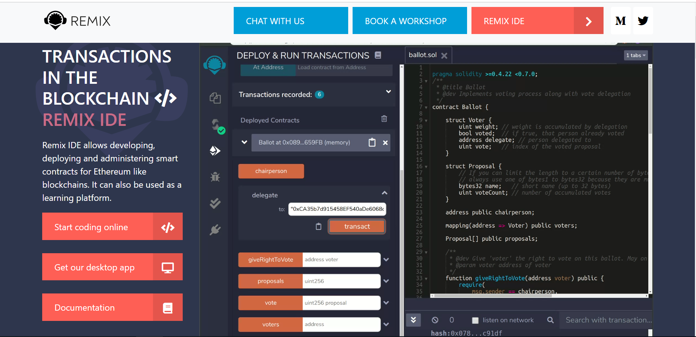

# solidity基础笔记
## 简单介绍
**solidity**是一门面向合约的、为实现智能合约而创建的高级编程语言，能在以太坊虚拟机（EVM）上运行。它是一门静态语言。内含的类型除了常见编程语言中的标准类型，还包括address等以太坊独有的类型。以太坊不仅是一种加密数字货币，它更是功能完备的智能合约平台，solidity就是用来开发以太坊上的智能合约的原生开发语言。solidity最早发布于2015年，它是第一种图灵完备的智能合约专用开发语言。目前除了以太坊之外，在其他区块链中也逐渐开始支持solidity，例如hyperledger fabric、tendermint等。solidity源码文件通常以 **.sol**作为扩展名。详细教程可以参考[官网](https://soliditylang.org/)
## 语言特性
它的语法接近于Javascript，是一种面向对象的语言。但作为一种真正意义上运行在网络上的去中心合约，它又有很多的不同，下面列举一些：

* 以太坊底层是基于帐户，而非UTXO的，所以有一个特殊的Address的类型。用于定位用户，定位合约，定位合约的代码（合约本身也是一个帐户）。
* 由于语言内嵌框架是支持支付的，所以提供了一些关键字，如payable，可以在语言层面直接支持支付，而且超级简单。
* 存储是使用网络上的区块链，数据的每一个状态都可以永久存储，所以需要确定变量使用内存，还是区块链。
* 运行环境是在去中心化的网络上，会比较强调合约或函数执行的调用的方式。因为原来一个简单的函数调用变为了一个网络上的节点中的代码执行，分布式的感觉。
* 最后一个非常大的不同则是它的异常机制，一旦出现异常，所有的执行都将会被回撤，这主要是为了保证合约执行的原子性，以避免中间状态出现的数据不一致。

## 开发环境
目前solidity编程最好的方式是使用Remix（地址：https://remix.ethereum.org/ ），这是一个基于web浏览器的IDE，可在线使用而无需安装任何东西，可以编写solidity智能合约，然后编译、部署并运行该智能合约。



如图所示，就是官网页面，可以点击**Start coding online**就可以在线编写solidity代码，并且可以在线运行，无需安装。当然也可以点击下载安装包，安装到本地。

## 基础数据类型
### 1、布尔类型（bool）
取值为常量值true和false。
### 2、整型（int/uint）
分别表示的是有符号或无符号整型。支持从**uint8**到**uint256**，以及**int8**到**int256**，**uint**和**int**默认代表的是**uint256**和**int256**，变量支持的步长以8递增。
### 3、浮点类型（fixed/ufixed）
分别表示有符号或无符号的浮点型。
### 4、地址（address）
这也是**solidity**中特有的一种数据类型，存储一个20字节的值（以太坊地址的大小）。地址类型也有成员变量，并作为合约的基础。以下是三种常见的成员变量。

* **balance（uint256）** 查询该地址的以太币余额，以Wei为单位。
* **transfer（uint256）** 向该地址发送指定数量的以太币，以Wei为单位，失败时抛出异常。
* **send（uint256）** 向该地址发送指定数量的以太币，以Wei为单位，失败时返回false。

```solidity
//SPDX-License-Identifier: GPL-3.0
pragma solidity >=0.5.0 <0.9.0;

contract Deposit{
    address public owner;
    constructor(){
        //这个是获取当前合约创建者的address
        owner=msg.sender;
    }
    //合约中只能有一个使用此语法接受的函数
    receive() external payable{
    }

    fallback() external payable{
    }

    function getBalance() public view returns(uint) {
        //返回的是当前用户address的余额
        return address(this).balance;
    }

    function transferEther(address payable recipient,uint amount)public returns(bool){
        require(owner==msg.sender,"Transfer failed,you are not the owner!!!");
        if(amount<=getBalance()){
            //转移一定数量的余额
            recipient.transfer(amount);
            return true;
        }else{
            return false;
        }
    }
}
```
### 5、枚举类型（）enum
一种用户自定义类型。可以显示的转换与整数进行转换，默认从0开始递增，一般用来模拟合约的状态。枚举类型应至少有一名成员。
```solidity
//SPDX-License-Identifier: GPL-3.0
pragma solidity >=0.5.0 <0.9.0;

contract Academy{
    Instructor public academyInstructor;
    enum State {Open,Closed,Unknow}
    State public academyState=State.Open;
}
```
以上的例子是定义了一种枚举类型**State**，然后将类型中的**Open**状态赋值给**academyState**。

### 6、字节数组类型（定长和不定长）
bytes1， … ，bytes32，允许值以步长1递增。byte默认表示byte1，这些是定长的字节数组类型。不定长字节数组类型声明为**bytes**。
### 7、字符串
String：字符串文字用双引号或单引号如“foo”或'bar'编写。用于任意长度的UTF数据。
```solidity
string language ="Solidity";
```
### 8、数组（定长\动态）
Solidity中的数组可以具有编译时固定大小，也可以是动态的。将数组声明为public将自动为其创建getter方法（可以根据索引获取值）。
```solidity
//SPDX-License-Identifier: GPL-3.0
pragma solidity >=0.5.0 <0.9.0;

contract FixedSizeArrays {
    uint[3] public numbers=[1,3,5];

    bytes1 public b1;
    bytes2 public b2;
    bytes3 public b3;
    function setElement(uint index,uint value) public {
        numbers[index]=value;
    }

    function getLength() public view returns(uint){
        return numbers.length;
    }

    function setBytesArray() public{
        b1='a';
        b2='ab';
        b3='abc';
    }
}
```

```solidity
//SPDX-License-Identifier: GPL-3.0
pragma solidity >=0.5.0 <0.9.0;

contract DynamicArrays{
    uint[] public numbers;

    function getLength() public view returns(uint){
        return numbers.length;
    }

    function addElement(uint item) public{
        numbers.push(item);
    }

    function getElement(uint i) public view returns(uint){
        if(i < numbers.length){
            return numbers[i];
        }

        return 0;
    }

    function popElement() public {
        numbers.pop();
    }

    function f() public pure{
        uint[] memory y=new uint[](3);
        y[0]=1;
        y[1]=2;
        y[2]=3;
    }
}
```
### 9、结构体（struct）
Structs是自定义类型，可以对多个变量进行分组。注意：结构只能有16个成员，超过该成员可能会发生以下错误：Stack too Deep 堆栈太深。
结构允许创建具有多个属性的更复杂的数据类型。
```solidity
//SPDX-License-Identifier: GPL-3.0
pragma solidity >=0.5.0 <0.9.0;

struct Instructor{
    uint age;
    string name;
    address addr;
}

contract Academy{
    Instructor public academyInstructor;

    enum State {Open,Closed,Unknow}
    State public academyState=State.Open;

    constructor(uint _age,string memory _name){
        academyInstructor.age=_age;
        academyInstructor.name=_name;
        academyInstructor.addr=msg.sender;
    }

    function changeInstructor(uint _age,string memory _name,address _addr) public{
       if(academyState==State.Open){
            Instructor memory myInstructor=Instructor({
            age:_age,
            name:_name,
            addr:_addr
        });
        academyInstructor=myInstructor;
       }
    }

}
contract School{
    Instructor public schoolInstructor;
}
```
### 10、映射（mapping）
映射可以看作是哈希表，它们被虚拟地初始化，使得每个可能的键都存在并被映射到其字节表示全为零的值：类型的默认值。
```solidity
//SPDX-License-Identifier: GPL-3.0
pragma solidity >=0.5.0 <0.9.0;

contract Auction{
    mapping(address=>uint) public bids;

    function bid() payable public {
        bids[msg.sender]=msg.value;
    }
}
```
## 数据位置
所有的复杂类型（数组、结构、映射），都有一个额外属性就是数据位置，用来说明数据是存储在内存**memory**还是存储**storage**中。根据上下文不同，大多数时候数据有默认的位置，但也可以通过在类型名后加上关键字**memory**或**storage**来进行修改。函数参数（包括返回的参数）的数据位置默认是**memory**，局部变量默认是**storage**，状态变量默认是**storage**。

## 函数
### 1、函数可见性/访问权限

* **public**：**public**函数是合约接口的一部分，可以在内部或通过消息调用。对于**public**状态变量，会自动生成一个getter函数

* **private**：**private**函数和状态变量金在当前定义他们的合约中使用，并且不能被派生合约使用

* **external**：**external**函数是合约接口的一部分，可以从其他合约和交易中调用。一个外部函数f不能从内部调用（即f不起作用，但this.f()可以）。当收到大量数据的时候，外部函数有时候会更有效率

* **internal**：**internal**函数和状态变量只能是内部访问（即从当前合约内部或从它派生的合约访问），不能用this调用。

### 函数状态可变性

* **view**：不允许修改状态
* **pure**：纯函数，不允许访问或修改状态
* **payable**：允许从消息调用中接收以太币
* **constant**：与view相同，一般只修饰状态变量，不允许赋值（除初始化以外)

## 拍卖合约的例子
```solidity
//SPDX-License-Identifier: GPL-3.0
pragma solidity >=0.5.0 <0.9.0;


contract AuctionCreator{
    Auction[] public auctions;

    function createAuction() public{
        Auction newAuction = new Auction(msg.sender);
        auctions.push(newAuction);
    }
}

contract Auction{

    address payable public owner;

    uint public startBlock;
    uint public endBlock;

    string public ipfsHash;

    enum State {Started,Running,Ended,Canceled}

    State public auctionState;

    uint public highestBindingBid;
    address payable public highestBidder;

    mapping(address=>uint) public bids;

    uint bidIncrement;

    constructor(address eoa){
        owner = payable(eoa);
        auctionState = State.Running;

        startBlock = block.number;
        endBlock = startBlock+40320;

        ipfsHash = "";
        bidIncrement = 100; 
    }

    modifier notOwner(){
        require(msg.sender != owner);
        _;
    }
    modifier afterStart(){
        require(block.number>=startBlock);
        _;
    }

    modifier beforeEnd(){
        require(block.number<=endBlock);
        _;
    }

    modifier onlyOwner(){
        require(msg.sender==owner);
        _;
    }

    function cancelAuction() public onlyOwner{
        auctionState=State.Canceled;

    }

    function min(uint a,uint b)pure internal returns(uint){
        if(a<=b){
            return a;
        }else {
            return b;
        }
    }

    function placeBid() public payable notOwner afterStart beforeEnd {
        require(auctionState==State.Running);
        require(msg.value>=100);
        uint currentBid = bids[msg.sender] + msg.value;
        require(currentBid > highestBindingBid); 
        bids[msg.sender]=currentBid;
        if(currentBid<=bids[highestBidder]){
            highestBindingBid=min(currentBid+bidIncrement,bids[highestBidder]);
        }else{
            highestBindingBid=min(currentBid,bids[highestBidder]+bidIncrement);
            highestBidder=payable(msg.sender);
        }
    }

    function finalizeAuction() public{
        require(auctionState==State.Canceled || block.number>endBlock);
        require(msg.sender==owner||bids[msg.sender]>0);
        address payable recipient;
        uint value;
        if(auctionState==State.Canceled){
            recipient=payable(msg.sender);
            value=bids[msg.sender];
        }else{
            if(msg.sender==owner){
                recipient=owner;
                value=highestBindingBid;
            }else{
                if(msg.sender==highestBidder){
                    recipient=highestBidder;
                    value = bids[highestBidder]-highestBindingBid;
                }else{
                    recipient=payable(msg.sender);
                    value=bids[msg.sender];
                }
            }
        }
        bids[recipient]=0;
        recipient.transfer(value);
    }
}
```

