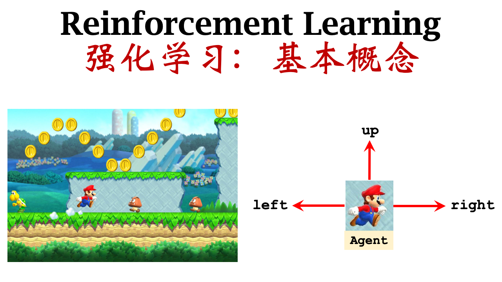

# 强化学习中的基本概念
## 状态(state)和动作(action)
一个状态可以想象成游戏中的一帧画面，整个游戏就是由多帧画面组成的。值的注意的是，$t$时刻的画面可能有多种，它与智能体选择的动作有关，因此，状态具有随机性。我们将$t$时刻的状态记作$St$。动作是智能体与环境交互时所发出的，好的动作能够使智能体适应环境，从而获取较高的奖励，而坏的动作可能使得智能体在游戏局中失败
 

例如在上面的图片中，这张图片就是当前状态，马里奥做成的动作就是action。所以有三种动作：向上、向左和向右。

## 策略(policy $\pi$)
我们知道当前马里奥的状态如何控制它做出动作？策略$\pi$就是根据观测到的状态(state)做出决策，控制智能体(agent)做出动作(action)。策略一般定义为一个**概率密度函数**。
$$\pi(a|s)=\mathbb{P}(A=a|S=s)$$

例如在上面的图片中，我们输入当前状态$s$，可以得出向上、向右和向左的概率。
* $\pi(left|s)=0.2$
* $\pi(right|s)=0.1$
* $\pi(up|s)=0.7$
强化学习主要是学习这个策略函数，根据策略函数我们可以根据当前状态做出决策。

## 奖励(reward)
agent做出一个动作，游戏就会给出奖励，这个奖励通常由我们自己来定义，还是以超级玛丽的游戏作为例子，我们可以定义如下奖励：
* 吃到金币：$R=1$
* 赢得游戏：$R=10000$
* 碰到敌人：$R=-10000$
* 什么没发生：$R=0$

## 状态转移(state transition)
智能体做出一个动作，游戏就会从一个状态(state)转移到一个新的状态(state)。也就是马里奥执行一个动作（例如向上跳），游戏就会显示到另一个画面。我们通常认为状态转移是随机的，随机性取决于环境。
$$p(s^\prime,a)=\mathbb{P}(S^\prime=s^\prime|S=s,A=a)$$

这个公式是观测到当前的状态$s$和动作$a$，状态变成$s^\prime$的概率

## 回报(return)
回报(return)定义为未来的累计奖励，英文为:cumulative future reward。（注意和奖励的区别）。我们把$t$时刻的奖励记为:$U_t$
$$U_t=R_t+R_{t+1}+R_{t+2}+\cdots$$

也就是把从t时刻的奖励加起来，直到游戏结束。下面思考一个问题：$R_t$和$R_{t+1}$同样重要吗？这个问题相当于你是选择我现在给你100元还是我一年后给你100元。大部分人会选择现在得到100元，因为未来有太多不确定性。所以未来的奖励没有现在的奖励重要，因此我们要给$R_{t+1}$较小的权重。所以我们通常使用折扣回报(Discounted return)这个概念，定义一个折扣系数$\gamma(0<\gamma<1)$，也就是上面说的权重。
$$U_t=R_t+\gamma R_{t+1}+\gamma ^2R_{t+2}+\cdots$$

当然回报也具有随机性，随机性主要有两个来源动作(action)和状态(state)

* 动作的随机：$$\pi(a|s)=\mathbb{P}(A=a|S=s)$$

* 状态的随机：$$p(s^\prime,a)=\mathbb{P}(S^\prime=s^\prime|S=s,A=a)$$

这两个公式意思就是：根据当前状态得出一个随机的动作，更具当前的动作和状态得出一个状态转移。所以**奖励$R_i$ 取决于$S_i$和$A_i$**。

## 价值函数(Value Function)
### 动作价值函数(Action-Value Function)
动作价值函数记作$Q(s,a)$。首先上面所讲的回报$U_t$只是一个随机变量，它取决于未来所有的动作和状态，由于$U_t$是一个随机变量，在$t$时刻我并不知道$U_t$是什么，所以我们可以对$U_t$求期望，把随机性用积分积掉，最后得到的就是一个数。
$$Q_\pi(s_t,a_t)=\mathbb{E}[U_t|S_t=s_t,A_t=a_t] $$
根据这个式子求出的期望就是动作价值函数，除了$s_t$和$a_t$其余的随机变量都被积分积掉了。所以动作价值函数$Q_\pi$与当前状态$s_t$和当前动作$a_t$有关，还与策略函数policy $\pi$有关，因为积分时会用到。那么如何将这个策略函数去掉？我们可以取最大值。

$$Q^*(s_t,a_t)=\underset{\pi}{max} Q_\pi(s_t,a_t)$$

也就是我们取能使$Q$最大化的策略函数

### 状态价值函数(State-Value Function)
状态价值函数记作$V(s)$，是动作价值函数$Q_\pi$的期望
$$V_\pi=\mathbb{E}_A[Q_\pi(s_t,A)]= {\textstyle \sum_{a}}\pi(a|s_t)\cdot Q_\pi(s_t,a)  $$
$$V_\pi=\mathbb{E}_A[Q_\pi(s_t,A)]=  \int \pi(a|s_t)\cdot Q_\pi(s_t,a) da $$
这里的期望是根据随机变量$A$求的，上面的两种情况分别对应变量离散和连续的两种情况。

### 两种价值函数的对比
动作价值函数$Q_\pi$，告诉我们，使用价值函数policy $\pi$，智能体处于状态s时做出动作a是否明智，可以给该动作打分。状态价值函数$V_\pi$，如果使用价值函数$\pi$，可以评价当前状态是好还是坏（游戏是快赢了还是快输了）。还可以评价价值函数$\pi$的好坏，如果$\pi$越好，那么$\mathbb{E}_S[V_\pi(S)]$，也就是$V_\pi$的平均值就越大。