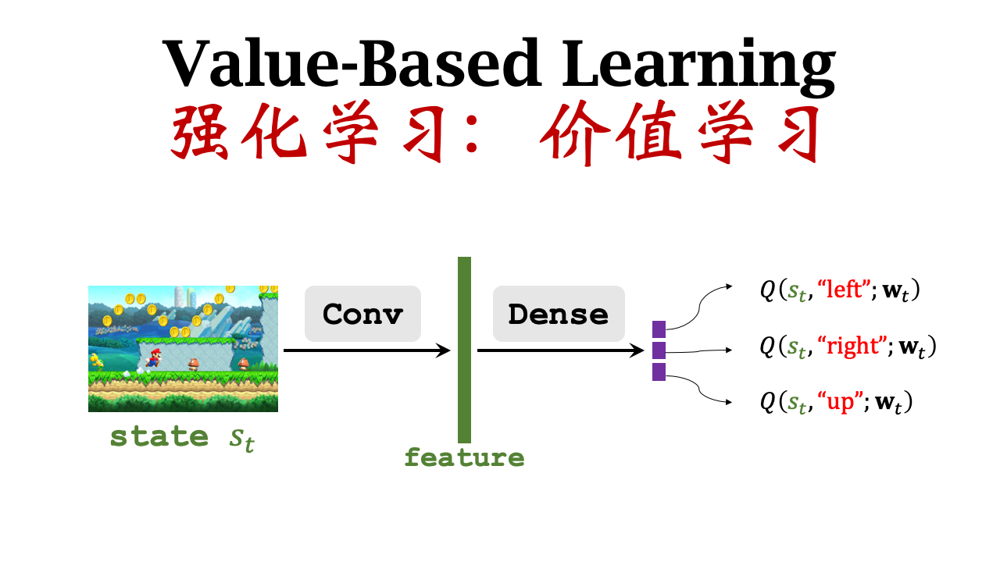
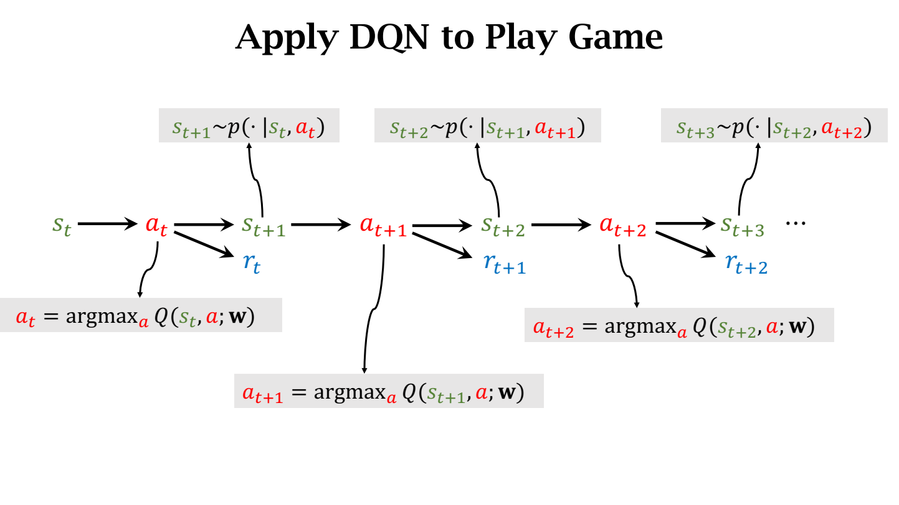

# 价值学习
上一篇博客已经介绍了一些强化学习的基本概念，其中包括了价值函数：动作价值函数和状态价值函数。首先动作价值函数$Q^*$能告诉你每个动作带来的平均回报，所以我们应该选择平均回报最高的那个，但是我们并不知道$Q^*$函数，价值学习的基本思想就是学习一个函数来近似$Q^*$。下面介绍价值学习的一些概念
## Deep Q-Network(DQN)
其实就是利用神经网络近似$Q^* $函数。所以我们使用神经网络$Q(s,a;w)$来近似$Q*(s,a)$。所以引入了DQN这种神经网络，如下图所示

这幅图就是DQN网络的示意图，我们通过当前的状态，输出对不同动作的打分(上、左、右)，然后智能体选择分数较大的动作。

这幅图就是说明在游戏中，DQN的变换状态，智能体不断的选择得分最高的action，然后迁移到下一个状态。下面我们来分析如何训练这个神经网络。

## Temporal Difference (TD) Learning
时间差分学习：指从采样得到的不完整的状态序列学习，该方法通过合理的 bootstrapping，先估计某状态在该状态序列(episode)完整后可能得到的 return，并在此基础上利用累进更新平均值的方法得到该状态的价值，再通过不断的采样来持续更新这个价值。概念还是比较难理解的。下面看一个简单的例子。

首先有一个模型$Q(w)$预测从A触发到达B需要1000分钟，那下面开始更新模型，我们的预测$q=Q(w),q=1000$，然后我们实际走一遍这个路程，发现我们实际花费了860分钟，那么我们可以开始更新模型。那么计算损失Loss $L=\frac {1}{2}(q-y)^2$，下面我们对Loss关于w求导$\frac{\partial L}{\partial w}=\frac{\partial L}{\partial q} \cdot \frac{\partial q}{\partial w}  =(q-y)\frac{\partial Q(w)}{\partial w} $。梯度求出来之后，我们可以根据梯度下降来跟新参数$w_{t+1}=w_t-\alpha \cdot \frac {\partial L}{\partial w}|_{w=w_{t}}$。这种方法是一种常见的方法，但是我必须完成整个旅程才能更细模型，如果我不完成整个路程，走到半路就不前进了，该如何更新？下面就引出了TD算法。

我们从A出发到C时，已经花费了300分钟，然后模型告诉我们从C到终点B还要花费600分钟，那么我们就可以预测最终会花费900分钟，虽然900也是估计的但其中还有一部分是真实的，所以比1000更为准确一点。这就是TD算法的大致意思，下面看一下TD算法在DQN中的应用。

$$T_{A->B}\approx T_{A->C}+T_{C+B}$$
这个公式就是对上面行程问题的总结，下面看一下在DQN中
$$Q(s_t,a_t;w)\approx r_t+\gamma\cdot Q(s_{t+1},a_{t+1};w)$$
可以做一个不太严谨的证明：
$$
U_t=R_t+\gamma R_{t+1}+\gamma ^2R_{t+2}+\cdots
\\  
    = R_t+\gamma (R_{t+1}+\gamma R_{t+2}+\cdots)
\\
=R_t+ \gamma\cdot U_{t+1} 
$$
下面我们就可以使用TD learning来训练DQN，首先我们获取了在$t$时刻的模型预测值$Q(s_t,a_t;w_t)$。到了$t+1$时刻，我们观测到了真实的结果
$$y_t=r_t+\gamma \cdot Q(s_{t+1},a_{t+1};w_t)
\\
=r_t+\gamma \cdot \underset{a}{max} Q(s_{t+1},a;w_t)
$$
所以得出损失值$L_t=\frac{1}{2}[Q(s_t,a_t;w)-y_t]^2$。根据梯度下降更新损失值。

## 总结
我们知道根据$Q*$函数能够反映每一个动作的好坏，只要有了该函数，我们就能根据该函数来控制agent运动，每一个时刻智能体只要选出得分最高的动作执行就可以，但是实际是我们并没有$Q^*$函数，所以价值学习的目的就是学习一个$Q^*$函数。所以我们使用DQN来近似一个$Q^*$函数，然后根据TD算法来跟新迭代DQN模型。