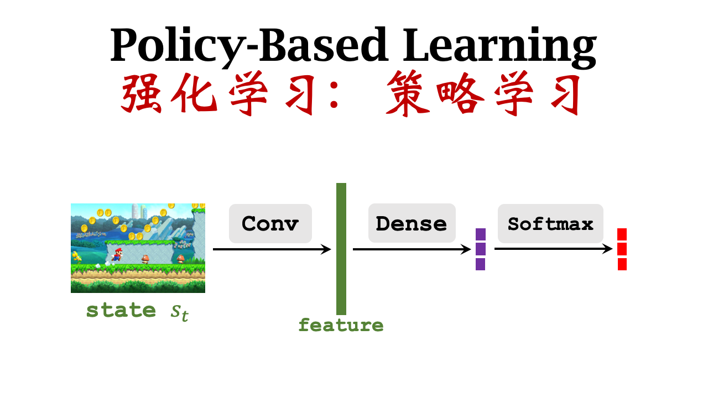

# 策略学习
前面已经学习过了策略函数$\pi(a|s)$，这是一个概率密度函数。只要有了一个好的策略函数，我们就可以根据策略函数自动控制智能体运动，所以下面我们就讨论如何找出一个函数来近似策略函数。
## 策略网络(policy network)
这里就是利用神经网络$\pi(a|s;\theta)$来近似策略函数$\pi(a|s)$，其中$\theta$是神经网络的参数，我们主要是通过学习来改进$\theta$

使用$softmax$激活函数是为了使得输出的概率值和为1（即归一化）。

## 策略学习
前面我们已经使用神经网络来将近似策略函数$\pi(a|s)$，下面使用近似的策略函数来表示状态价值函数。
$$V(s_t;\theta)= {\textstyle \sum_{a}}\pi(a|s_t;\theta)\cdot Q_{\pi}(s_t,a) $$

$\theta$就是神经网络中的参数。我们通过改进$\theta$的值来使得$V$的值变大
$$J(\theta)=\mathbb{E}_S[V(S;\theta)]$$
通过求S的期望，我们可以把S消掉，最后只剩下$\theta$，所以最终目标就是不断改进$\theta$，使得$J(\theta)$变大

## 策略梯度(policy gradient)
首先观测到一个状态$s$，
$$
\frac{\partial{V(s;\theta)}}{\partial{\theta}}=\frac{\partial{{\textstyle \sum_{a}}\pi(a|s_t;\theta)\cdot Q_{\pi}(s_t,a)}}{\partial{\theta}}
\\
={\textstyle \sum_{a}} \frac{\partial{\pi(a|s_t;\theta)\cdot Q_{\pi}(s_t,a)}}{\partial{\theta}}
$$
然后我们假设$Q_{\pi}$不依赖于$\theta$
$$
={\textstyle \sum_{a}} \frac{\partial{\pi(a|s_t;\theta)}}{\partial{\theta}}\cdot Q_{\pi}(s_t,a)
\\
={\textstyle \sum_{a}} \pi(a|s_t;\theta) \cdot \frac{\partial{ln\pi(a|s_t;\theta)}}{\partial{\theta}}\cdot Q_{\pi}(s_t,a)
\\
=\mathbb{E}_{A}[ \frac{\partial{ln\pi(a|s_t;\theta)}}{\partial{\theta}}\cdot Q_{\pi}(s_t,a)]
$$
计算离散的值，如超级玛丽中，动作action只有{"left","right","up"}这三种状态，我们可以利用上面的公式$\frac{\partial{V(s;\theta)}}{\partial{\theta}}={\textstyle \sum_{a}} \frac{\partial{\pi(a|s_t;\theta)}}{\partial{\theta}}\cdot Q_{\pi}(s_t,a)$来计算$f(a,\theta)$，可以得到策略梯度：
$$\frac{\partial{V(s;\theta)}}{\partial{\theta}}=f("left",\theta)+f("right",\theta)+f("up",\theta)$$

当然如果是连续的动作，例如动作空间是啊0-1之间的连续变量$\frac{\partial{V(s;\theta)}}{\partial{\theta}}=\mathbb{E}_{A \sim \pi(\cdot | s;\theta)}[ \frac{\partial{ln\pi(A|s_t;\theta)}}{\partial{\theta}}\cdot Q_{\pi}(s_t,A)]$
然后我们进行蒙特卡洛近似从$\pi(\cdot | s;\theta)$随机抽样$\hat{a}$，然后计算$g(\hat{a},\theta)=\frac{\partial{ln\pi(\hat{a}|s;\theta)}}{\partial{\theta}}\cdot Q_{\pi}(s,\hat{a})$。显而易见的，由于是随机抽样的$g(\hat{a},\theta)$是$\frac{\partial{V(s;\theta)}}{\partial{\theta}}$的无偏估计。策略梯度求出之后，就可以根据策略梯度更新策略网络，$\theta_{t+1}=\theta_{t}+\beta \cdot g(a_t,\theta_{t})$。
## 总结
策略学习就是求出一个策略函数$\pi$，然后根据策略函数自动控制智能体的运动。然后我们通过神经网路求策略函数，这个神经网络就是策略网络，然后通过策略梯度更新策略网络中的参数。