  <!--  动态打字效果 -->
  

    
  

  <!-- knock code pictures 敲代码的图片 -->
  <picture>
    <source media="(prefers-color-scheme: dark)" srcset="https://cdn.jsdelivr.net/gh/sun0225SUN/sun0225SUN/assets/images/coding.gif" />
    <source media="(prefers-color-scheme: light)" srcset="https://cdn.jsdelivr.net/gh/sun0225SUN/sun0225SUN/assets/images/developer.svg" height="225px" />
    
  </picture>

  <!-- for beauty 留个空行好看点 -->
  
&nbsp;

  <!-- profile logo 个人资料徽标 -->
  

    </a>&emsp;
    &emsp;
    &emsp;
    <!-- visitor -->
    &emsp;

  

<h1 align="center">🙋 Hello</h1>

**我们正在让这个世界变得更加美好，通过代码的重复使用和延展构建完美体系。**

&emsp;&emsp;<strong>We're making the world a better place. Through constructing elegant hierarchies for maximum code reuse and extensibility.</strong>

<h2 align="center">About me</h1>
<picture>
  
</picture>

<h1 align="center">Habits</h1>
<picture>
  
</picture>

<picture>
  
</picture>

<h2 align="center">Recent</h1>

<picture>
  
</picture>

<!-- run 图片 -->

